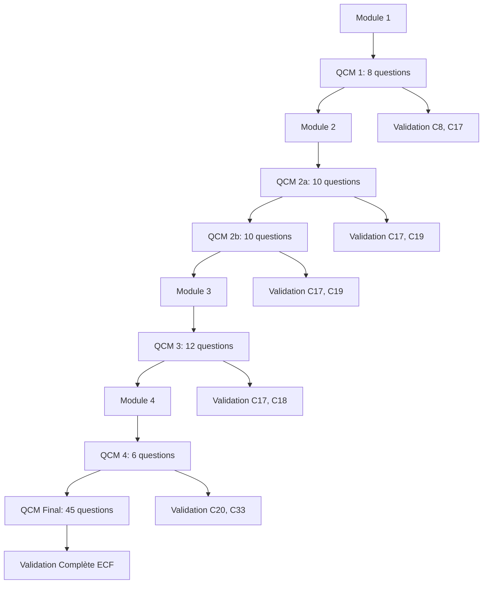

# Évaluations - Formation CI/CD

## ✅ Vue d'Ensemble des Évaluations

Cette section contient tous les QCM et évaluations de la formation, organisés pour valider progressivement les acquis et préparer à l'évaluation finale ECF.

## 🗂️ Structure des Évaluations

### [QCM Intermédiaires](qcm-intermediaires/README.md)
**Objectif** : Validation des acquis par module | **Format** : QCM avec correction immédiate

| Module | QCM | Questions | Durée | Compétences | Seuil |
|--------|-----|-----------|-------|-------------|-------|
| **1** | [Fondamentaux CI/CD](qcm-intermediaires/module-1-qcm.md) | 8 | 15 min | C8, C17 | 75% |
| **2a** | [IA et Tests - Partie 1](qcm-intermediaires/module-2-qcm.md#partie-1) | 10 | 20 min | C17, C19 | 70% |
| **2b** | [IA et Tests - Partie 2](qcm-intermediaires/module-2-qcm.md#partie-2) | 10 | 20 min | C17, C19 | 70% |
| **3** | [Tests Fonctionnels](qcm-intermediaires/module-3-qcm.md) | 12 | 25 min | C17, C18 | 70% |
| **4** | [Documentation/Monitoring](qcm-intermediaires/module-4-qcm.md) | 6 | 15 min | C20, C33 | 70% |

### [QCM Final](qcm-final/README.md)
**Objectif** : Évaluation ECF complète | **Format** : Évaluation officielle

- **[QCM Final Complet](qcm-final/qcm-final.md)** - 45 questions, 60 minutes
- **[Grille d'Évaluation](qcm-final/grille-evaluation.md)** - Critères ECF par compétence
- **[Rapport d'Évaluation](qcm-final/rapport-evaluation-template.md)** - Template officiel

## 🎯 Navigation par Compétence

### C8 - Test Driven Development (TDD)
- **[Module 1 - Questions 3-5](qcm-intermediaires/module-1-qcm.md#questions-tdd)**
- **[QCM Final - Questions 5-8](qcm-final/qcm-final.md#section-tdd)**

### C17 - Tests Automatisés dans CI/CD
- **[Module 1 - Questions 1-2, 6-8](qcm-intermediaires/module-1-qcm.md#questions-tests-cicd)**
- **[Module 2 - Toutes les questions](qcm-intermediaires/module-2-qcm.md)**
- **[Module 3 - Questions 1-8](qcm-intermediaires/module-3-qcm.md#questions-tests-fonctionnels)**
- **[QCM Final - Questions 1-4, 9-23, 24-38](qcm-final/qcm-final.md#section-tests-automatises)**

### C18 - Sécurité DevSecOps
- **[Module 3 - Questions 9-12](qcm-intermediaires/module-3-qcm.md#questions-securite)**
- **[QCM Final - Questions 39-41](qcm-final/qcm-final.md#section-securite)**

### C19 - Clean Code et Optimisation
- **[Module 2 - Questions focus optimisation](qcm-intermediaires/module-2-qcm.md#questions-optimisation)**
- **[QCM Final - Questions 42-43](qcm-final/qcm-final.md#section-clean-code)**

### C20 - Documentation Technique
- **[Module 4 - Questions 1-4](qcm-intermediaires/module-4-qcm.md#questions-documentation)**
- **[QCM Final - Questions 44-45](qcm-final/qcm-final.md#section-documentation)**

### C33 - Surveillance et Maintenance
- **[Module 4 - Questions 5-6](qcm-intermediaires/module-4-qcm.md#questions-monitoring)**
- **[QCM Final - Questions 46-47](qcm-final/qcm-final.md#section-monitoring)**

## 📊 Progression des Évaluations

## 📋 Types de Questions

### QCM Intermédiaires
- **Choix multiple** (1 bonne réponse parmi 4)
- **Vrai/Faux** avec justification
- **Association** (concepts ↔ outils)
- **Mise en ordre** (étapes de processus)

### QCM Final
- **Choix multiple** (1 bonne réponse parmi 4)
- **Questions à réponses multiples** (plusieurs bonnes réponses)
- **Cas pratiques** avec analyse de situation
- **Questions de synthèse** transversales

## 🎯 Critères d'Évaluation

### QCM Intermédiaires
- **Seuil de réussite** : 70-75% selon le module
- **Feedback immédiat** : Correction avec explications
- **Rattrapage** : Possibilité de repasser après révision

### QCM Final (ECF)
- **Seuil global** : 70% minimum (32/45 questions)
- **Seuil par compétence** : 60% minimum par compétence
- **Durée** : 60 minutes maximum
- **Conditions** : Surveillance, sans documentation

## 📅 Planning des Évaluations

### Jour 1 (Lundi)
- **13:00-13:15** : [QCM Module 1](qcm-intermediaires/module-1-qcm.md)

### Jour 2 (Mardi)
- **12:00-12:20** : [QCM Module 2a](qcm-intermediaires/module-2-qcm.md#partie-1)
- **17:00-17:20** : [QCM Module 2b](qcm-intermediaires/module-2-qcm.md#partie-2)

### Jour 4 (Jeudi)
- **17:00-17:25** : [QCM Module 3](qcm-intermediaires/module-3-qcm.md)

### Jour 5 (Vendredi)
- **12:00-12:15** : [QCM Module 4](qcm-intermediaires/module-4-qcm.md)
- **14:00-15:00** : **[QCM Final ECF](qcm-final/qcm-final.md)**

## 🔗 Liens Croisés

### Théorie ↔ Évaluation
Chaque question est liée aux contenus théoriques correspondants :

| Question | Contenu Théorique | Exercice Pratique |
|----------|-------------------|-------------------|
| Module 1 Q1-2 | [Concepts CI/CD](../modules/module-1-fondamentaux/support-theorique.md#concepts) | [Exercice 1.1](../exercices/module-1/exercice-1-1.md) |
| Module 1 Q3-5 | [Types de tests](../modules/module-1-fondamentaux/support-theorique.md#types-tests) | [Exercice 1.2](../exercices/module-1/exercice-1-2.md) |
| Module 2 Q1-5 | [Tests avec IA](../modules/module-2-ia-tests/support-theorique.md#tests-ia) | [Exercices 2.1-2.2](../exercices/module-2/README.md) |

### Exercices ↔ Évaluation
Les questions évaluent directement les compétences développées dans les exercices :

- **Pipeline CI/CD** : Exercice 1.1 → Questions Module 1 (1-2) → QCM Final (1-4)
- **Tests automatisés** : Exercices 1.2-1.3 → Questions Module 1 (6-8) → QCM Final (9-15)
- **Tests IA** : Exercices 2.1-2.5 → Questions Module 2 → QCM Final (16-23)

## 📊 Statistiques et Suivi

### Indicateurs de Performance
- **Taux de réussite** par module et par question
- **Temps moyen** de completion
- **Questions les plus difficiles**
- **Progression par compétence**

### Tableaux de Bord
- **[Formateur](../guides/guide-formateur.md#suivi-evaluations)** : Suivi temps réel des résultats
- **[Apprenant](../guides/guide-apprenant.md#suivi-progression)** : Progression personnelle

## 🛠️ Outils d'Évaluation

### Formats Disponibles
- **HTML interactif** : QCM avec correction automatique
- **PDF imprimable** : Version papier pour examens surveillés
- **JSON/XML** : Import dans LMS (Moodle, etc.)

### Fonctionnalités
- **Timer intégré** pour les évaluations chronométrées
- **Sauvegarde automatique** des réponses
- **Génération de rapports** individuels et collectifs
- **Export des résultats** vers Excel/CSV

## 🆘 Support Évaluation

### Pendant les QCM
- **Instructions claires** avant chaque évaluation
- **Support technique** en cas de problème
- **Conditions d'examen** respectées

### Après les QCM
- **Correction détaillée** avec explications
- **Recommandations** de révision personnalisées
- **Accès aux ressources** complémentaires

---

## 🧭 Navigation

### Navigation Principale
- **[⬅️ Retour à l'index](../index.md)**
- **[📚 Voir les modules](../modules/README.md)**
- **[💻 Voir les exercices](../exercices/README.md)**

### Évaluations
- **[📝 QCM Intermédiaires](qcm-intermediaires/README.md)**
- **[🎓 QCM Final](qcm-final/README.md)**
- **[📊 Grilles d'évaluation](qcm-final/grille-evaluation.md)**

### Outils Formateur
- **[📈 Suivi des résultats](../guides/guide-formateur.md#evaluations)**
- **[⚙️ Configuration QCM](../guides/guide-formateur.md#configuration-qcm)**
- **[📋 Rapports ECF](../guides/guide-formateur.md#rapports-ecf)**

### Outils Apprenant
- **[🎯 Suivi progression](../guides/guide-apprenant.md#evaluations)**
- **[📚 Révisions ciblées](../guides/guide-apprenant.md#revisions)**
- **[💡 Conseils réussite](../guides/guide-apprenant.md#conseils-qcm)**

*Navigation mise à jour automatiquement*