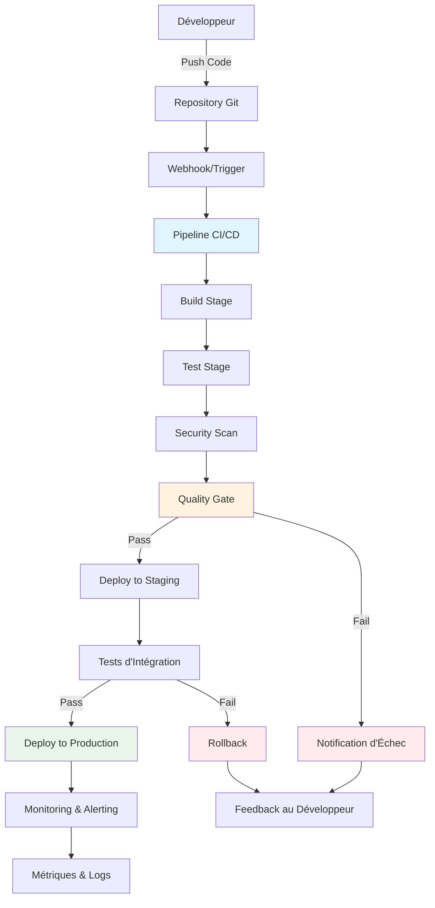

# Diagramme d'Architecture CI/CD Générale

## Description
Ce diagramme illustre le flux complet d'un pipeline CI/CD moderne, depuis le commit du développeur jusqu'au déploiement en production avec monitoring.

## Points Clés
- **Automatisation complète** : Chaque étape est automatisée
- **Quality Gates** : Points de contrôle qualité
- **Feedback rapide** : Notifications immédiates en cas d'échec
- **Rollback automatique** : Retour en arrière en cas de problème