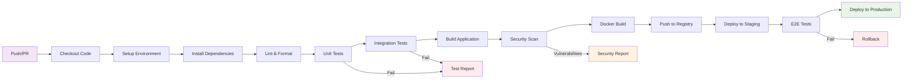

# Pipeline GitHub Actions - Workflow Détaillé

## Étapes du Pipeline

### Phase de Validation
1. **Checkout Code** : Récupération du code source
2. **Setup Environment** : Configuration de l'environnement (Node.js, Python, etc.)
3. **Install Dependencies** : Installation des dépendances
4. **Lint & Format** : Vérification du style de code

### Phase de Test
5. **Unit Tests** : Tests unitaires
6. **Integration Tests** : Tests d'intégration
7. **Security Scan** : Analyse de sécurité

### Phase de Build
8. **Build Application** : Compilation/Build de l'application
9. **Docker Build** : Création de l'image Docker
10. **Push to Registry** : Publication dans le registry

### Phase de Déploiement
11. **Deploy to Staging** : Déploiement en environnement de test
12. **E2E Tests** : Tests end-to-end
13. **Deploy to Production** : Déploiement en production