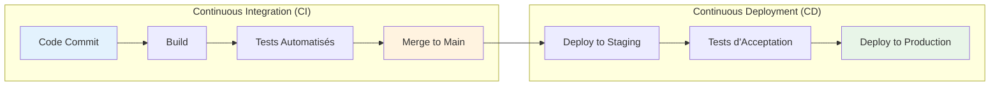
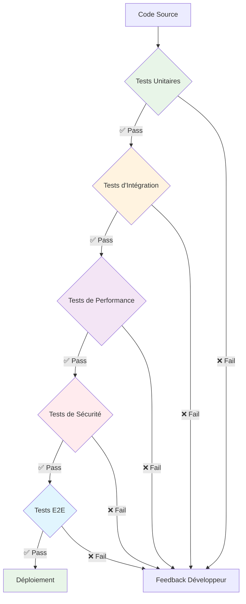
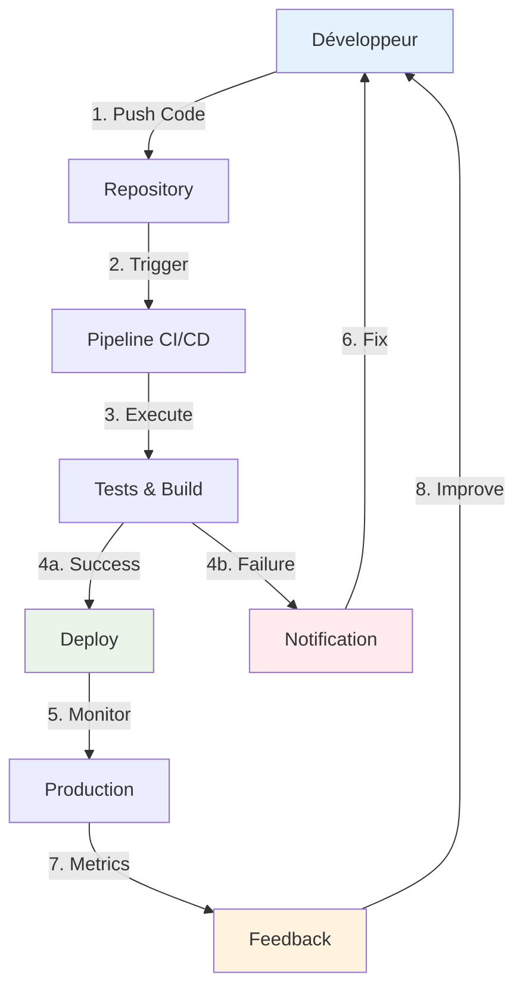

# Schémas Explicatifs - Concepts CI/CD

## 1. Différence CI vs CD

### Explication
- **CI** : Intégration fréquente du code avec validation automatique
- **CD** : Déploiement automatique après validation CI

---

## 2. Types de Tests dans le Pipeline

### Progression des Tests
1. **Unitaires** : Rapides, isolés
2. **Intégration** : Composants ensemble
3. **Performance** : Charge et stress
4. **Sécurité** : Vulnérabilités
5. **E2E** : Parcours utilisateur complet

---

## 3. Feedback Loop dans CI/CD

### Boucle de Feedback
- **Rapide** : Notification immédiate des échecs
- **Continue** : Monitoring permanent en production
- **Amélioration** : Optimisation basée sur les métriques