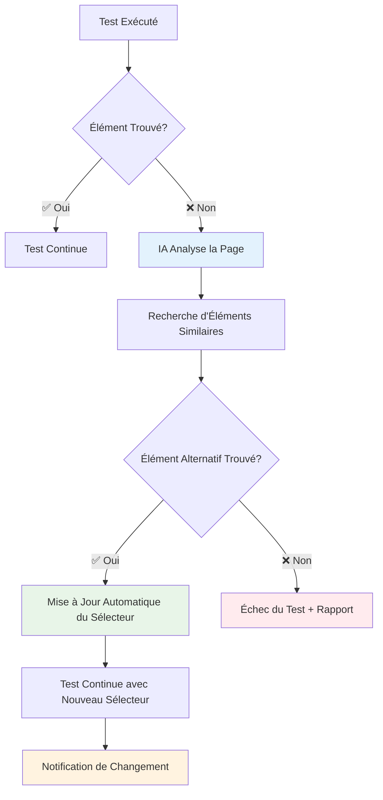
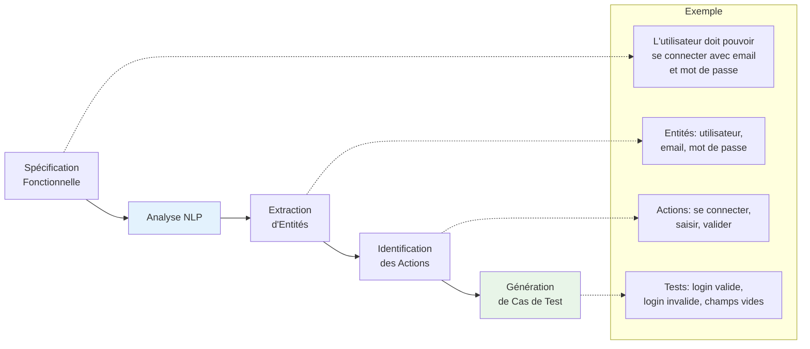
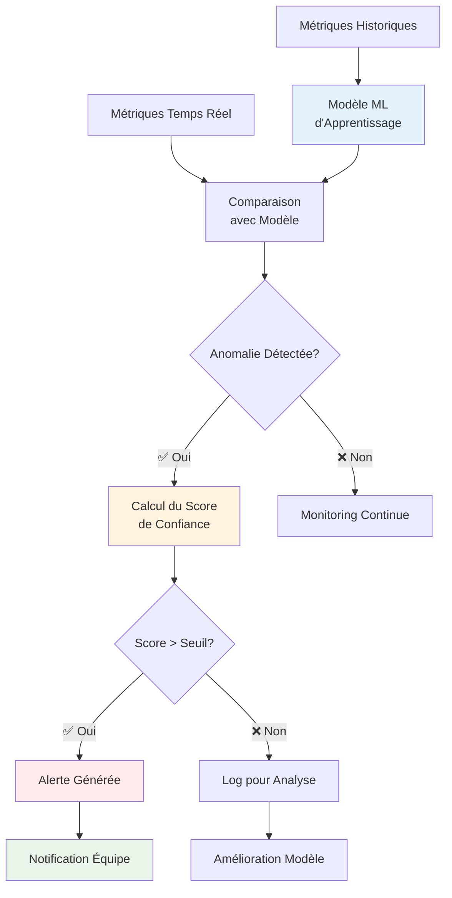

# Schémas Explicatifs - IA dans les Tests

## 1. Auto-Healing des Tests

### Avantages de l'Auto-Healing
- **Réduction de la maintenance** : Moins d'interventions manuelles
- **Stabilité** : Tests plus robustes aux changements UI
- **Productivité** : Focus sur les vrais problèmes

---

## 2. Génération de Tests avec NLP

### Processus NLP
1. **Analyse** : Compréhension du langage naturel
2. **Extraction** : Identification des éléments clés
3. **Génération** : Création automatique des tests

---

## 3. Détection d'Anomalies avec Machine Learning

### Types d'Anomalies Détectées
- **Performance** : Temps de réponse anormaux
- **Erreurs** : Pics d'erreurs inattendus
- **Utilisation** : Patterns d'usage inhabituels
- **Sécurité** : Tentatives d'intrusion