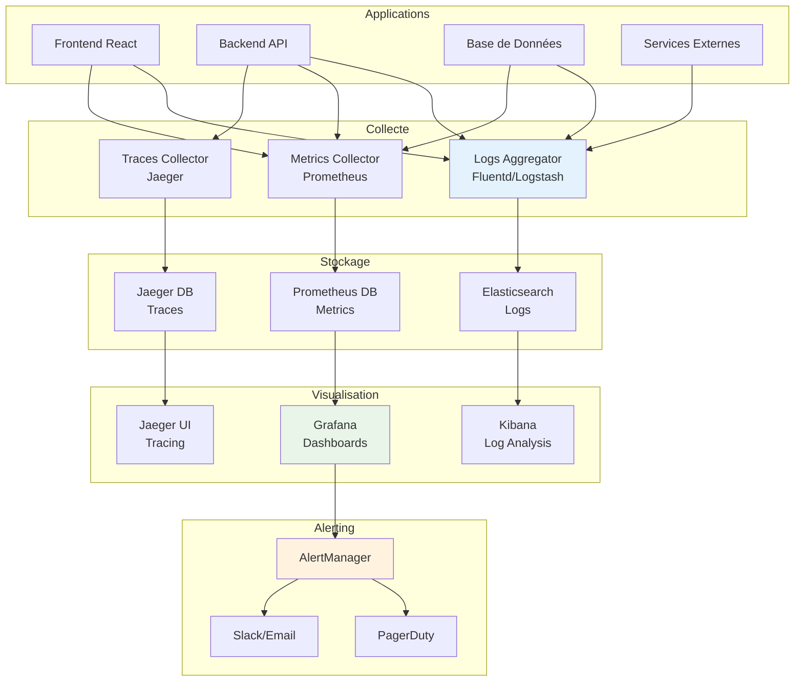
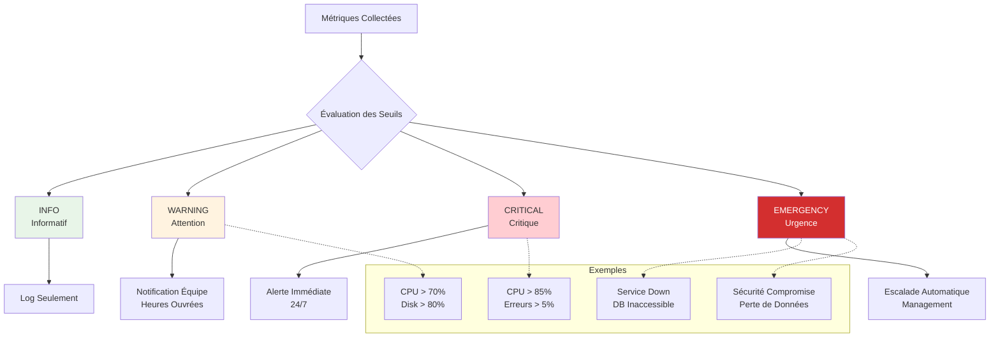
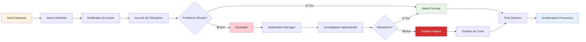

# Schémas Explicatifs - Monitoring et Alerting

## 1. Architecture de Monitoring Complète

---

## 2. Niveaux d'Alerting

---

## 3. Cycle de Vie d'une Alerte

### Bonnes Pratiques
- **Seuils Adaptés** : Éviter les fausses alertes
- **Escalade Claire** : Processus défini
- **Documentation** : Runbooks pour chaque alerte
- **Amélioration Continue** : Analyse post-incident