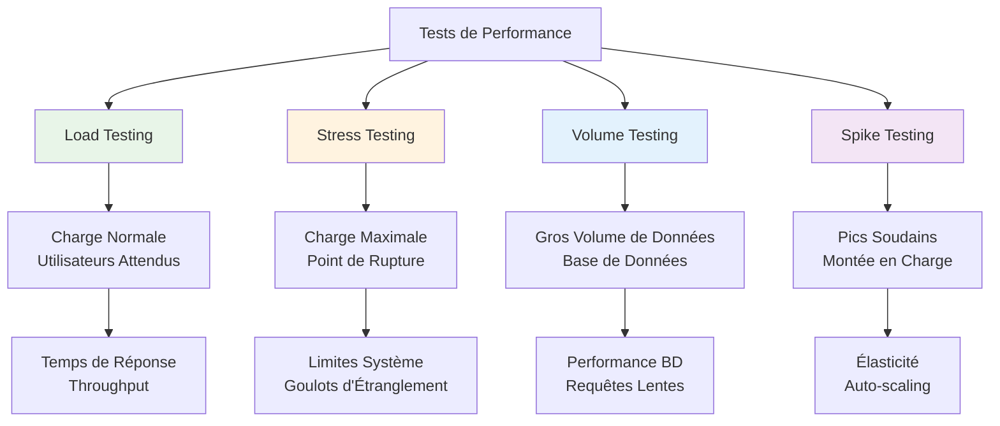
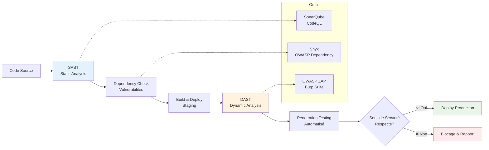
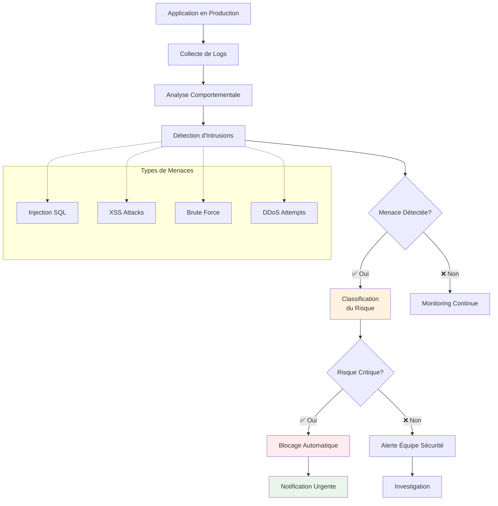

# Schémas Explicatifs - Tests de Performance et Sécurité

## 1. Types de Tests de Performance

### Objectifs par Type
- **Load** : Comportement sous charge normale
- **Stress** : Identification des limites
- **Volume** : Impact des gros volumes de données
- **Spike** : Réaction aux pics de trafic

---

## 2. Pipeline de Tests de Sécurité

### Types d'Analyse
- **SAST** : Analyse statique du code source
- **DAST** : Tests dynamiques sur l'application
- **Dependency** : Vérification des dépendances

---

## 3. Monitoring de Sécurité en Continu

### Réponse aux Incidents
- **Automatique** : Blocage immédiat des menaces critiques
- **Manuelle** : Investigation pour les risques modérés
- **Préventive** : Amélioration continue des défenses