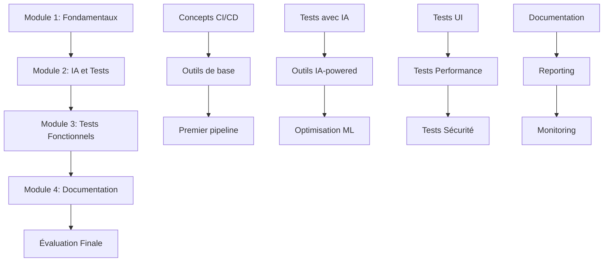

# Modules de Formation CI/CD

## 📚 Vue d'Ensemble des Modules

Cette section contient tous les supports théoriques de la formation, organisés en 4 modules progressifs.

## 🗂️ Structure des Modules

### [Module 1 - Fondamentaux CI/CD](module-1-fondamentaux/README.md)
**Durée** : 4 heures | **Niveau** : Débutant

- **[📖 Support théorique](module-1-fondamentaux/support-theorique.md)** (30 slides équivalent)
- **[💻 Exercices pratiques](../exercices/module-1/README.md)** (3 exercices)
- **[✅ QCM intermédiaire](../evaluations/qcm-intermediaires/module-1-qcm.md)** (8 questions)

**Objectifs** :
- Comprendre les concepts CI/CD
- Maîtriser les outils de base (GitHub Actions, Jenkins)
- Intégrer les tests dans un pipeline

### [Module 2 - IA et Automatisation des Tests](module-2-ia-tests/README.md)
**Durée** : 10 heures | **Niveau** : Intermédiaire

- **[📖 Support théorique](module-2-ia-tests/support-theorique.md)** (45 slides équivalent)
- **[💻 Exercices pratiques](../exercices/module-2/README.md)** (5 exercices)
- **[✅ QCM intermédiaires](../evaluations/qcm-intermediaires/module-2-qcm.md)** (2 × 10 questions)

**Objectifs** :
- Automatiser les tests avec l'IA
- Utiliser des outils IA-powered (Testim, Applitools, Mabl)
- Optimiser les tests avec machine learning

### [Module 3 - Tests Fonctionnels et Non-Fonctionnels](module-3-tests-fonctionnels/README.md)
**Durée** : 6 heures | **Niveau** : Intermédiaire/Avancé

- **[📖 Support théorique](module-3-tests-fonctionnels/support-theorique.md)** (35 slides équivalent)
- **[💻 Exercices pratiques](../exercices/module-3/README.md)** (6 exercices)
- **[✅ QCM intermédiaire](../evaluations/qcm-intermediaires/module-3-qcm.md)** (12 questions)

**Objectifs** :
- Maîtriser les tests UI (Selenium, Cypress)
- Implémenter les tests de performance (JMeter)
- Intégrer les tests de sécurité (OWASP ZAP)

### [Module 4 - Documentation et Monitoring](module-4-documentation/README.md)
**Durée** : 2 heures | **Niveau** : Intermédiaire

- **[📖 Support théorique](module-4-documentation/support-theorique.md)** (20 slides équivalent)
- **[💻 Exercices pratiques](../exercices/module-4/README.md)** (2 exercices)
- **[✅ QCM intermédiaire](../evaluations/qcm-intermediaires/module-4-qcm.md)** (6 questions)

**Objectifs** :
- Documenter les tests automatisés
- Créer des rapports avec Allure
- Monitorer avec Grafana/Prometheus

## 🎯 Progression Pédagogique

## 🔗 Liens Croisés

### Théorie ↔ Pratique
Chaque section théorique est directement liée aux exercices correspondants :

| Concept Théorique | Exercice Pratique | QCM Associé |
|-------------------|-------------------|-------------|
| Pipeline CI/CD | [Exercice 1.1](../exercices/module-1/exercice-1-1.md) | [Q1-Q3](../evaluations/qcm-intermediaires/module-1-qcm.md#q1-q3) |
| Tests automatisés | [Exercice 1.2](../exercices/module-1/exercice-1-2.md) | [Q4-Q6](../evaluations/qcm-intermediaires/module-1-qcm.md#q4-q6) |
| Tests parallèles | [Exercice 1.3](../exercices/module-1/exercice-1-3.md) | [Q7-Q8](../evaluations/qcm-intermediaires/module-1-qcm.md#q7-q8) |

### Compétences Transversales
Les compétences sont développées progressivement à travers les modules :

- **C8 (TDD)** : Module 1 → Module 2 → Module 3
- **C17 (Tests CI/CD)** : Tous les modules
- **C18 (DevSecOps)** : Module 3 principalement
- **C19 (Clean Code)** : Module 2 → Module 4
- **C20 (Documentation)** : Module 4 principalement
- **C33 (Monitoring)** : Module 4 principalement

## 📋 Navigation Rapide

### Par Jour de Formation
- **[Jour 1](../index.md#jour-1---lundi)** : Module 1 complet + début Module 2
- **[Jour 2](../index.md#jour-2---mardi)** : Module 2 (suite)
- **[Jour 3](../index.md#jour-3---mercredi)** : Fin Module 2 + début Module 3
- **[Jour 4](../index.md#jour-4---jeudi)** : Module 3 (suite)
- **[Jour 5](../index.md#jour-5---vendredi)** : Fin Module 3 + Module 4 + Évaluation

### Par Type d'Activité
- **[📖 Tous les supports théoriques](#structure-des-modules)**
- **[💻 Tous les exercices](../exercices/README.md)**
- **[✅ Toutes les évaluations](../evaluations/README.md)**

### Outils de Navigation
- **[🔍 Index général](../index.md)** - Navigation complète
- **[📊 Tableau de bord formateur](../guides/guide-formateur.md#tableau-de-bord)**
- **[🎓 Espace apprenant](../guides/guide-apprenant.md#navigation)**

---

## 🧭 Navigation

- **[⬅️ Retour à l'index](../index.md)**
- **[➡️ Commencer Module 1](module-1-fondamentaux/README.md)**
- **[📚 Voir les exercices](../exercices/README.md)**
- **[✅ Voir les évaluations](../evaluations/README.md)**

*Navigation mise à jour automatiquement*