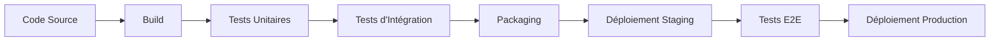

# 2. Mise en Place d'un Pipeline CI/CD de Base

## 🎯 Objectifs d'Apprentissage

À l'issue de cette section, vous serez capable de :
- Comprendre les concepts fondamentaux de CI/CD
- Différencier CI, CD (Delivery) et CD (Deployment)
- Identifier les composants d'un pipeline CI/CD
- Configurer un pipeline simple avec GitHub Actions

## 🔄 Concepts Fondamentaux CI/CD

### Continuous Integration (CI)

#### Définition
L'intégration continue est une pratique de développement où les développeurs intègrent fréquemment leur code dans un dépôt partagé, déclenchant automatiquement des builds et des tests.

#### Principes Clés
- **Commits fréquents** : Intégration plusieurs fois par jour
- **Build automatique** : Compilation automatique du code
- **Tests automatiques** : Validation immédiate des changements
- **Feedback rapide** : Notification immédiate des problèmes

#### Bénéfices
- **Détection précoce des bugs** : Problèmes identifiés rapidement
- **Réduction des conflits** : Intégration fréquente évite les gros merges
- **Qualité constante** : Validation continue du code
- **Confiance accrue** : Base de code toujours stable

### Continuous Delivery (CD)

#### Définition
La livraison continue étend la CI en automatisant la préparation des releases, rendant le code toujours prêt à être déployé en production.

#### Caractéristiques
- **Automatisation complète** : Du code à l'environnement de staging
- **Déploiement manuel** : Décision humaine pour la production
- **Environnements identiques** : Cohérence dev/staging/prod
- **Rollback facile** : Retour en arrière rapide si nécessaire

### Continuous Deployment (CD)

#### Définition
Le déploiement continu pousse l'automatisation jusqu'au déploiement automatique en production après validation des tests.

#### Différences avec Delivery
- **Déploiement automatique** : Aucune intervention humaine
- **Tests exhaustifs** : Couverture de test très élevée requise
- **Monitoring avancé** : Surveillance continue de la production
- **Culture DevOps mature** : Organisation adaptée aux changements fréquents

## 🏗️ Architecture d'un Pipeline CI/CD

### Composants Principaux



### 1. Source Control
- **Git** : Gestion de versions distribuée
- **Branches** : Stratégies de branching (GitFlow, GitHub Flow)
- **Pull Requests** : Revue de code et validation

### 2. Build Stage
- **Compilation** : Transformation du code source
- **Gestion des dépendances** : Installation des packages
- **Optimisation** : Minification, bundling
- **Artefacts** : Production des livrables

### 3. Test Stage
- **Tests unitaires** : Validation des composants isolés
- **Tests d'intégration** : Vérification des interactions
- **Tests de sécurité** : Scan des vulnérabilités
- **Analyse de code** : Qualité et conformité

### 4. Deploy Stage
- **Environnements** : Dev, Staging, Production
- **Stratégies** : Blue-Green, Rolling, Canary
- **Configuration** : Gestion des variables d'environnement
- **Monitoring** : Surveillance post-déploiement

## 🛠️ Outils CI/CD Populaires

### Plateformes Cloud
- **GitHub Actions** : Intégré à GitHub, workflows YAML
- **GitLab CI/CD** : Pipeline as Code, runners distribués
- **Azure DevOps** : Suite complète Microsoft
- **AWS CodePipeline** : Service AWS natif

### Solutions On-Premise
- **Jenkins** : Open source, très extensible
- **TeamCity** : JetBrains, interface intuitive
- **Bamboo** : Atlassian, intégration Jira
- **CircleCI** : Cloud et on-premise

### Outils Spécialisés
- **Docker** : Containerisation des applications
- **Kubernetes** : Orchestration de conteneurs
- **Terraform** : Infrastructure as Code
- **Ansible** : Automatisation de configuration

## 🚀 GitHub Actions - Introduction

### Concepts de Base

#### Workflow
Processus automatisé défini dans un fichier YAML, déclenché par des événements.

```yaml
name: CI Pipeline
on:
  push:
    branches: [ main, develop ]
  pull_request:
    branches: [ main ]
```

#### Jobs
Ensemble d'étapes exécutées sur un runner.

```yaml
jobs:
  build:
    runs-on: ubuntu-latest
    steps:
      - uses: actions/checkout@v3
      - name: Setup Node.js
        uses: actions/setup-node@v3
        with:
          node-version: '18'
```

#### Actions
Composants réutilisables pour automatiser des tâches.

```yaml
- name: Run tests
  run: npm test
- name: Upload coverage
  uses: codecov/codecov-action@v3
```

### Structure d'un Workflow

```yaml
name: Complete CI/CD Pipeline

on:
  push:
    branches: [ main ]
  pull_request:
    branches: [ main ]

env:
  NODE_VERSION: '18'

jobs:
  test:
    runs-on: ubuntu-latest
    steps:
      - name: Checkout code
        uses: actions/checkout@v3
      
      - name: Setup Node.js
        uses: actions/setup-node@v3
        with:
          node-version: ${{ env.NODE_VERSION }}
          cache: 'npm'
      
      - name: Install dependencies
        run: npm ci
      
      - name: Run linting
        run: npm run lint
      
      - name: Run unit tests
        run: npm test -- --coverage
      
      - name: Upload coverage reports
        uses: codecov/codecov-action@v3

  build:
    needs: test
    runs-on: ubuntu-latest
    steps:
      - name: Checkout code
        uses: actions/checkout@v3
      
      - name: Setup Node.js
        uses: actions/setup-node@v3
        with:
          node-version: ${{ env.NODE_VERSION }}
          cache: 'npm'
      
      - name: Install dependencies
        run: npm ci
      
      - name: Build application
        run: npm run build
      
      - name: Upload build artifacts
        uses: actions/upload-artifact@v3
        with:
          name: build-files
          path: dist/

  deploy:
    needs: build
    runs-on: ubuntu-latest
    if: github.ref == 'refs/heads/main'
    steps:
      - name: Download build artifacts
        uses: actions/download-artifact@v3
        with:
          name: build-files
          path: dist/
      
      - name: Deploy to staging
        run: |
          echo "Deploying to staging environment"
          # Commandes de déploiement
```

## 🔧 Configuration d'un Pipeline Simple

### Étape 1 : Préparation du Projet

```bash
# Structure du projet
my-app/
├── .github/
│   └── workflows/
│       └── ci.yml
├── src/
├── tests/
├── package.json
└── README.md
```

### Étape 2 : Configuration Package.json

```json
{
  "name": "my-app",
  "scripts": {
    "test": "jest",
    "lint": "eslint src/",
    "build": "webpack --mode production",
    "start": "node dist/server.js"
  },
  "devDependencies": {
    "jest": "^29.0.0",
    "eslint": "^8.0.0",
    "webpack": "^5.0.0"
  }
}
```

### Étape 3 : Workflow CI/CD

```yaml
name: CI/CD Pipeline

on:
  push:
    branches: [ main, develop ]
  pull_request:
    branches: [ main ]

jobs:
  quality-checks:
    runs-on: ubuntu-latest
    steps:
      - uses: actions/checkout@v3
      
      - name: Setup Node.js
        uses: actions/setup-node@v3
        with:
          node-version: '18'
          cache: 'npm'
      
      - name: Install dependencies
        run: npm ci
      
      - name: Code linting
        run: npm run lint
      
      - name: Security audit
        run: npm audit --audit-level high
      
      - name: Run tests
        run: npm test -- --coverage --watchAll=false
      
      - name: SonarCloud Scan
        uses: SonarSource/sonarcloud-github-action@master
        env:
          GITHUB_TOKEN: ${{ secrets.GITHUB_TOKEN }}
          SONAR_TOKEN: ${{ secrets.SONAR_TOKEN }}

  build-and-deploy:
    needs: quality-checks
    runs-on: ubuntu-latest
    if: github.ref == 'refs/heads/main'
    steps:
      - uses: actions/checkout@v3
      
      - name: Setup Node.js
        uses: actions/setup-node@v3
        with:
          node-version: '18'
          cache: 'npm'
      
      - name: Install dependencies
        run: npm ci
      
      - name: Build application
        run: npm run build
      
      - name: Build Docker image
        run: |
          docker build -t my-app:${{ github.sha }} .
          docker tag my-app:${{ github.sha }} my-app:latest
      
      - name: Deploy to staging
        run: |
          echo "Deploying to staging environment"
          # Commandes de déploiement spécifiques
```

## 📊 Métriques et Monitoring

### Métriques de Pipeline
- **Temps de build** : Durée totale du pipeline
- **Taux de succès** : Pourcentage de builds réussis
- **Temps de feedback** : Délai entre commit et notification
- **Fréquence de déploiement** : Nombre de déploiements par période

### Monitoring des Applications
- **Uptime** : Disponibilité du service
- **Performance** : Temps de réponse, throughput
- **Erreurs** : Taux d'erreur, logs d'exception
- **Utilisation** : CPU, mémoire, stockage

### Outils de Monitoring
- **Prometheus + Grafana** : Métriques et dashboards
- **ELK Stack** : Logs centralisés
- **New Relic / DataDog** : APM complet
- **GitHub Insights** : Métriques de développement

## 🛡️ Sécurité dans les Pipelines

### Gestion des Secrets
```yaml
- name: Deploy to production
  env:
    API_KEY: ${{ secrets.API_KEY }}
    DB_PASSWORD: ${{ secrets.DB_PASSWORD }}
  run: |
    echo "Deploying with secure credentials"
```

### Scan de Sécurité
```yaml
- name: Security scan
  uses: securecodewarrior/github-action-add-sarif@v1
  with:
    sarif-file: security-scan-results.sarif
```

### Bonnes Pratiques
- **Principe du moindre privilège** : Permissions minimales
- **Rotation des secrets** : Renouvellement régulier
- **Audit des accès** : Traçabilité des actions
- **Isolation des environnements** : Séparation dev/prod

## 🎯 Stratégies de Déploiement

### Blue-Green Deployment
- **Deux environnements identiques** : Blue (actuel) et Green (nouveau)
- **Bascule instantanée** : Switch du trafic
- **Rollback rapide** : Retour à l'environnement précédent

### Rolling Deployment
- **Mise à jour progressive** : Instance par instance
- **Disponibilité continue** : Service toujours accessible
- **Détection d'erreurs** : Arrêt automatique si problème

### Canary Deployment
- **Déploiement partiel** : Petit pourcentage d'utilisateurs
- **Validation progressive** : Augmentation graduelle
- **Risque minimisé** : Impact limité en cas de problème

## 🎓 Points Clés à Retenir

1. **CI/CD = Automatisation** : Réduction des tâches manuelles répétitives
2. **Feedback rapide** : Détection précoce des problèmes
3. **Déploiements fréquents** : Réduction des risques par petits changements
4. **Culture DevOps** : Collaboration entre développement et opérations
5. **Amélioration continue** : Optimisation constante des processus

---

**Section précédente :** [Introduction à l'automatisation des tests](01-introduction-automatisation-tests.md)  
**Prochaine section :** [Intégration des tests dans CI/CD](03-integration-tests-cicd.md)

**Compétences travaillées :** C8, C17  
**Durée estimée :** 120 minutes