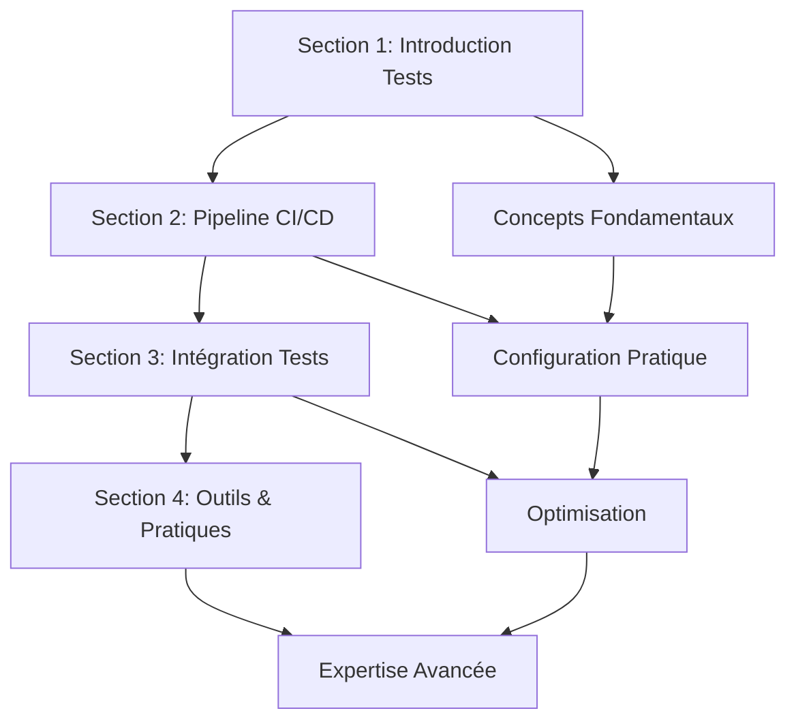

# Support Théorique - Module 1 : Fondamentaux CI/CD

## Vue d'Ensemble du Contenu

Ce support théorique couvre l'ensemble des concepts fondamentaux nécessaires pour comprendre et implémenter l'automatisation des tests dans un contexte CI/CD. Le contenu est structuré en 4 sections progressives, équivalent à 30 slides de présentation.

## Progression Pédagogique

### 🎯 Objectifs Généraux
À l'issue de ce module théorique, les apprenants seront capables de :
- Maîtriser les concepts fondamentaux de CI/CD
- Distinguer et utiliser les différents types de tests automatisés
- Configurer un pipeline CI/CD complet avec GitHub Actions
- Appliquer les bonnes pratiques de l'industrie
- Choisir les outils appropriés selon le contexte

## Structure du Contenu

### [Section 1 : Introduction à l'Automatisation des Tests](01-introduction-automatisation-tests.md)
**Durée :** 90 minutes | **Slides équivalent :** 8 slides

#### Points Clés Abordés
- **Tests Manuels vs Automatisés** : Avantages, inconvénients, cas d'usage
- **Catégories de Tests** : Unitaires, intégration, E2E, non-fonctionnels
- **Pyramide de Test** : Structure, répartition, principes
- **Critères de Sélection** : Quels tests automatiser, ROI
- **Métriques** : Couverture, qualité, performance

#### Compétences Développées
- Analyse des besoins en automatisation
- Compréhension des stratégies de test
- Évaluation du ROI de l'automatisation

---

### [Section 2 : Mise en Place d'un Pipeline CI/CD de Base](02-pipeline-cicd-base.md)
**Durée :** 120 minutes | **Slides équivalent :** 10 slides

#### Points Clés Abordés
- **Concepts CI/CD** : Définitions, différences CI/CD/CD
- **Architecture Pipeline** : Composants, flux, étapes
- **GitHub Actions** : Workflows, jobs, actions
- **Configuration** : YAML, variables, secrets
- **Stratégies de Déploiement** : Blue-Green, Rolling, Canary

#### Compétences Développées
- Configuration de workflows automatisés
- Compréhension des architectures CI/CD
- Maîtrise des outils cloud (GitHub Actions)

---

### [Section 3 : Intégration des Tests dans le Cycle CI/CD](03-integration-tests-cicd.md)
**Durée :** 150 minutes | **Slides équivalent :** 12 slides

#### Points Clés Abordés
- **Stratégies d'Intégration** : Placement, séquencement, parallélisation
- **Configuration par Type** : Unitaires, intégration, E2E
- **Optimisation** : Cache, parallélisation, fail-fast
- **Gates de Qualité** : Couverture, seuils, blocages
- **Reporting** : Notifications, métriques, dashboards

#### Compétences Développées
- Optimisation des pipelines de test
- Configuration d'environnements de test
- Mise en place de gates de qualité

---

### [Section 4 : Outils et Bonnes Pratiques](04-outils-bonnes-pratiques.md)
**Durée :** 120 minutes | **Slides équivalent :** 10 slides

#### Points Clés Abordés
- **Frameworks de Test** : Jest, Mocha, Cypress, Playwright, Selenium
- **Outils d'Analyse** : ESLint, SonarQube, Lighthouse
- **Infrastructure** : Docker, Kubernetes, IaC
- **Patterns Avancés** : Page Object Model, Factory Pattern
- **Monitoring** : Prometheus, Grafana, ELK Stack

#### Compétences Développées
- Sélection d'outils appropriés
- Application de patterns de test
- Mise en place de monitoring

## Ressources Pédagogiques

### Diagrammes et Schémas
- Pyramide de test interactive
- Architecture de pipeline CI/CD
- Flux de données dans les tests
- Comparaison d'outils

### Exemples de Code
- Configuration GitHub Actions complète
- Tests unitaires avec Jest
- Tests E2E avec Cypress et Playwright
- Configuration Docker multi-stage

### Cas Pratiques
- Projet web moderne (React/Node.js)
- API REST avec base de données
- Application microservices
- Pipeline de déploiement cloud

## Évaluation des Acquis

### Questions de Compréhension
Chaque section inclut des questions pour vérifier la compréhension :
- Questions conceptuelles
- Exercices de réflexion
- Cas d'usage pratiques

### QCM Intermédiaire
8 questions couvrant l'ensemble du module :
- 2 questions sur les concepts de base
- 2 questions sur les types de tests
- 2 questions sur les pipelines CI/CD
- 2 questions sur les outils et bonnes pratiques

## Liens entre les Sections

## Adaptation selon le Public

### Développeurs Débutants
- Focus sur les concepts de base
- Exemples simples et progressifs
- Accompagnement renforcé sur la configuration

### Développeurs Expérimentés
- Approfondissement des bonnes pratiques
- Patterns avancés
- Optimisations et monitoring

### DevOps/SRE
- Architecture et scalabilité
- Monitoring et observabilité
- Stratégies de déploiement avancées

## Ressources Complémentaires

### Documentation Officielle
- [GitHub Actions](https://docs.github.com/en/actions)
- [Jest](https://jestjs.io/docs/getting-started)
- [Cypress](https://docs.cypress.io/)
- [Playwright](https://playwright.dev/docs/intro)

### Articles et Blogs
- Martin Fowler sur les tests
- Google Testing Blog
- DevOps.com ressources CI/CD

### Outils en Ligne
- GitHub Actions Marketplace
- Cypress Dashboard
- SonarCloud

## Prochaines Étapes

Après ce module théorique, les apprenants pourront :
1. **Passer aux exercices pratiques** du Module 1
2. **Approfondir avec le Module 2** (IA et automatisation)
3. **Appliquer dans leurs projets** personnels ou professionnels

---

**Compétences ECF travaillées :** C8 (Réaliser des tests d'intégration), C17 (Automatiser les tests)  
**Durée totale :** 480 minutes (8 heures)  
**Format :** Théorie interactive avec démonstrations