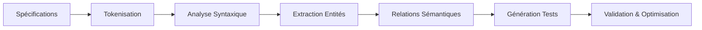

# Module 2 - IA et Automatisation des Tests
## Section 2 : Génération Automatique de Cas de Test avec NLP

### Objectifs d'Apprentissage
- Maîtriser les techniques NLP pour l'analyse de spécifications
- Implémenter la génération automatique de cas de test
- Utiliser les outils NLP spécialisés pour les tests

---

## 2.1 Fondamentaux du NLP pour les Tests

### Qu'est-ce que le Natural Language Processing ?

Le **NLP** (Natural Language Processing) est une branche de l'IA qui permet aux machines de comprendre, interpréter et générer le langage humain.

**Applications dans les Tests**
- Analyse de spécifications fonctionnelles
- Extraction d'exigences testables
- Génération automatique de scénarios
- Validation de cohérence documentaire

### Pipeline NLP pour les Tests



---

## 2.2 Techniques de Traitement du Langage

### 1. Tokenisation et Préprocessing

**Tokenisation**
```python
# Exemple avec spaCy
import spacy

nlp = spacy.load("fr_core_news_sm")
text = "L'utilisateur doit pouvoir se connecter avec son email"
doc = nlp(text)

tokens = [token.text for token in doc]
# Résultat : ['L'', 'utilisateur', 'doit', 'pouvoir', 'se', 'connecter', ...]
```

**Normalisation**
- Suppression des mots vides (stop words)
- Lemmatisation (forme canonique)
- Gestion de la casse et ponctuation

### 2. Analyse Syntaxique (POS Tagging)

```python
# Identification des parties du discours
for token in doc:
    print(f"{token.text}: {token.pos_} ({token.tag_})")

# Résultat :
# utilisateur: NOUN (NC)
# doit: VERB (V)
# pouvoir: VERB (VINF)
# connecter: VERB (VINF)
```

### 3. Reconnaissance d'Entités Nommées (NER)

```python
# Extraction d'entités métier
for ent in doc.ents:
    print(f"{ent.text}: {ent.label_}")

# Entités personnalisées pour les tests
patterns = [
    {"label": "ACTION", "pattern": [{"LOWER": {"IN": ["connecter", "valider", "créer"]}}]},
    {"label": "ACTOR", "pattern": [{"LOWER": "utilisateur"}]},
    {"label": "OBJECT", "pattern": [{"LOWER": {"IN": ["email", "mot de passe", "formulaire"]}}]}
]
```

---

## 2.3 Extraction de Règles Métier

### Patterns de Spécifications

**Pattern 1 : Règles de Validation**
```
"L'email doit être au format valide"
→ Test : Validation format email (positif/négatif)
```

**Pattern 2 : Workflows**
```
"Après connexion, l'utilisateur accède au tableau de bord"
→ Test : Vérification redirection post-connexion
```

**Pattern 3 : Contraintes**
```
"Le mot de passe doit contenir au moins 8 caractères"
→ Test : Validation longueur mot de passe
```

### Algorithme d'Extraction

```python
class TestCaseGenerator:
    def __init__(self):
        self.patterns = {
            'validation': r'doit être|doit contenir|format|valide',
            'workflow': r'après|puis|ensuite|redirection',
            'constraint': r'au moins|maximum|minimum|obligatoire'
        }
    
    def extract_test_scenarios(self, specification):
        scenarios = []
        
        # Analyse par phrases
        sentences = self.split_sentences(specification)
        
        for sentence in sentences:
            # Identification du type de règle
            rule_type = self.classify_rule(sentence)
            
            # Extraction des entités
            entities = self.extract_entities(sentence)
            
            # Génération des cas de test
            test_cases = self.generate_test_cases(rule_type, entities)
            scenarios.extend(test_cases)
        
        return scenarios
```

---

## 2.4 Génération de Cas de Test

### Templates de Génération

**Template pour Validation**
```json
{
  "type": "validation",
  "field": "{field_name}",
  "test_cases": [
    {
      "name": "Test {field_name} valide",
      "input": "{valid_value}",
      "expected": "success"
    },
    {
      "name": "Test {field_name} invalide",
      "input": "{invalid_value}",
      "expected": "error"
    }
  ]
}
```

**Template pour Workflow**
```json
{
  "type": "workflow",
  "steps": [
    {
      "action": "{action1}",
      "verification": "{expected_state1}"
    },
    {
      "action": "{action2}",
      "verification": "{expected_state2}"
    }
  ]
}
```

### Exemple Complet de Génération

**Spécification d'entrée :**
```
"L'utilisateur doit pouvoir se connecter avec un email valide et un mot de passe 
d'au moins 8 caractères. Après connexion réussie, il est redirigé vers le tableau de bord."
```

**Cas de test générés :**
```gherkin
Feature: Connexion utilisateur

Scenario: Connexion avec données valides
  Given l'utilisateur est sur la page de connexion
  When il saisit un email valide "user@example.com"
  And il saisit un mot de passe valide "password123"
  And il clique sur "Se connecter"
  Then il est redirigé vers le tableau de bord

Scenario: Connexion avec email invalide
  Given l'utilisateur est sur la page de connexion
  When il saisit un email invalide "invalid-email"
  And il saisit un mot de passe valide "password123"
  And il clique sur "Se connecter"
  Then un message d'erreur s'affiche

Scenario: Connexion avec mot de passe trop court
  Given l'utilisateur est sur la page de connexion
  When il saisit un email valide "user@example.com"
  And il saisit un mot de passe court "123"
  And il clique sur "Se connecter"
  Then un message d'erreur s'affiche
```

---

## 2.5 Outils et Frameworks NLP

### 1. Bibliothèques Open Source

**spaCy**
```python
# Installation et utilisation
pip install spacy
python -m spacy download fr_core_news_sm

import spacy
nlp = spacy.load("fr_core_news_sm")

# Analyse de spécifications
def analyze_specification(text):
    doc = nlp(text)
    
    # Extraction d'actions
    actions = [token.lemma_ for token in doc if token.pos_ == "VERB"]
    
    # Extraction d'objets métier
    objects = [ent.text for ent in doc.ents if ent.label_ in ["PERSON", "ORG"]]
    
    return {"actions": actions, "objects": objects}
```

**NLTK (Natural Language Toolkit)**
```python
import nltk
from nltk.tokenize import word_tokenize, sent_tokenize
from nltk.tag import pos_tag

# Analyse syntaxique
def analyze_with_nltk(text):
    sentences = sent_tokenize(text)
    
    for sentence in sentences:
        tokens = word_tokenize(sentence)
        pos_tags = pos_tag(tokens)
        
        # Extraction de patterns spécifiques
        verbs = [word for word, pos in pos_tags if pos.startswith('VB')]
        nouns = [word for word, pos in pos_tags if pos.startswith('NN')]
```

### 2. Services Cloud

**Google Cloud Natural Language API**
```python
from google.cloud import language_v1

def analyze_with_google_nlp(text):
    client = language_v1.LanguageServiceClient()
    document = language_v1.Document(content=text, type_=language_v1.Document.Type.PLAIN_TEXT)
    
    # Analyse des entités
    entities = client.analyze_entities(request={'document': document}).entities
    
    # Analyse du sentiment (pour prioriser les tests)
    sentiment = client.analyze_sentiment(request={'document': document}).document_sentiment
    
    return entities, sentiment
```

**Azure Text Analytics**
```python
from azure.ai.textanalytics import TextAnalyticsClient
from azure.core.credentials import AzureKeyCredential

def analyze_with_azure(text):
    client = TextAnalyticsClient(endpoint=endpoint, credential=AzureKeyCredential(key))
    
    # Extraction d'entités
    entities = client.recognize_entities(documents=[text])[0].entities
    
    # Extraction de phrases clés
    key_phrases = client.extract_key_phrases(documents=[text])[0].key_phrases
    
    return entities, key_phrases
```

---

## 2.6 Optimisation et Validation

### Métriques de Qualité

**Couverture des Exigences**
```python
def calculate_coverage(specifications, generated_tests):
    total_requirements = extract_requirements(specifications)
    covered_requirements = []
    
    for test in generated_tests:
        covered = map_test_to_requirements(test, total_requirements)
        covered_requirements.extend(covered)
    
    coverage = len(set(covered_requirements)) / len(total_requirements)
    return coverage * 100
```

**Pertinence des Tests**
```python
def evaluate_test_relevance(test_case, specification):
    # Analyse sémantique de similarité
    similarity = calculate_semantic_similarity(test_case.description, specification)
    
    # Vérification de la logique métier
    business_logic_score = validate_business_logic(test_case)
    
    # Score composite
    relevance_score = (similarity * 0.6) + (business_logic_score * 0.4)
    return relevance_score
```

### Techniques d'Amélioration

**1. Apprentissage Actif**
- Feedback humain sur les tests générés
- Amélioration itérative des modèles
- Adaptation aux spécificités métier

**2. Validation Croisée**
- Comparaison avec tests existants
- Validation par experts métier
- Tests A/B sur l'efficacité

**3. Optimisation Continue**
- Analyse des faux positifs/négatifs
- Ajustement des seuils de confiance
- Mise à jour des patterns de reconnaissance

---

## 2.7 Cas d'Usage Avancés

### Génération Multi-Langues

```python
class MultiLanguageTestGenerator:
    def __init__(self):
        self.models = {
            'fr': spacy.load("fr_core_news_sm"),
            'en': spacy.load("en_core_web_sm"),
            'es': spacy.load("es_core_news_sm")
        }
    
    def generate_tests(self, specification, language='fr'):
        nlp = self.models[language]
        doc = nlp(specification)
        
        # Génération adaptée à la langue
        return self.language_specific_generation(doc, language)
```

### Intégration avec Gherkin

```python
def generate_gherkin_scenarios(nlp_analysis):
    scenarios = []
    
    for rule in nlp_analysis['rules']:
        scenario = f"""
Scenario: {rule['title']}
  Given {rule['precondition']}
  When {rule['action']}
  Then {rule['expected_result']}
"""
        scenarios.append(scenario)
    
    return scenarios
```

---

## Points Clés à Retenir

1. **Le NLP permet** l'automatisation de la génération de tests à partir de spécifications
2. **Les techniques clés** : tokenisation, NER, analyse syntaxique, extraction de patterns
3. **La qualité dépend** de la richesse des spécifications et de la précision des modèles
4. **L'approche hybride** (IA + validation humaine) est recommandée
5. **L'amélioration continue** est essentielle pour maintenir la pertinence

---

## Prochaine Section
**Section 3 : Optimisation des Tests avec Machine Learning**
- Algorithmes de sélection intelligente
- Prédiction des zones à risque
- Optimisation des ressources de test