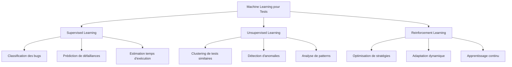

# Module 2 - IA et Automatisation des Tests
## Section 3 : Optimisation des Tests avec Machine Learning

### Objectifs d'Apprentissage
- Appliquer les algorithmes ML pour optimiser les suites de tests
- Implémenter la prédiction des zones à risque
- Maîtriser la sélection intelligente de tests

---

## 3.1 Introduction au Machine Learning pour les Tests

### Pourquoi le ML dans les Tests ?

**Problématiques Traditionnelles**
- Suites de tests trop longues (plusieurs heures d'exécution)
- Tests redondants ou obsolètes
- Difficultés à prioriser les tests critiques
- Maintenance coûteuse des tests fragiles

**Solutions ML**
- **Sélection intelligente** : Exécuter uniquement les tests pertinents
- **Prédiction de défaillances** : Identifier les zones à risque
- **Optimisation des ressources** : Distribution efficace des tests
- **Auto-maintenance** : Réparation automatique des tests cassés

### Types d'Apprentissage Appliqués



---

## 3.2 Sélection Intelligente de Tests

### Algorithmes de Sélection

**1. Test Impact Analysis (TIA)**

```python
class TestImpactAnalyzer:
    def __init__(self):
        self.code_coverage_history = {}
        self.test_execution_history = {}
    
    def analyze_changes(self, changed_files):
        """Analyse l'impact des changements de code"""
        impacted_tests = set()
        
        for file_path in changed_files:
            # Récupération des tests couvrant ce fichier
            covering_tests = self.get_covering_tests(file_path)
            impacted_tests.update(covering_tests)
        
        return list(impacted_tests)
    
    def get_covering_tests(self, file_path):
        """Retourne les tests qui couvrent un fichier donné"""
        covering_tests = []
        
        for test_name, coverage_data in self.code_coverage_history.items():
            if file_path in coverage_data['covered_files']:
                covering_tests.append(test_name)
        
        return covering_tests
```

**2. Algorithme de Priorisation par Risque**

```python
import numpy as np
from sklearn.ensemble import RandomForestClassifier

class RiskBasedTestPrioritizer:
    def __init__(self):
        self.model = RandomForestClassifier(n_estimators=100)
        self.features = [
            'code_complexity',
            'change_frequency',
            'bug_history',
            'test_execution_time',
            'last_failure_date'
        ]
    
    def train_model(self, historical_data):
        """Entraîne le modèle sur les données historiques"""
        X = historical_data[self.features]
        y = historical_data['failure_probability']
        
        self.model.fit(X, y)
    
    def prioritize_tests(self, test_suite):
        """Priorise les tests selon le risque prédit"""
        test_features = self.extract_features(test_suite)
        risk_scores = self.model.predict_proba(test_features)[:, 1]
        
        # Tri par score de risque décroissant
        prioritized_indices = np.argsort(risk_scores)[::-1]
        
        return [test_suite[i] for i in prioritized_indices]
```

**3. Optimisation Multi-Objectifs**

```python
from scipy.optimize import minimize

class MultiObjectiveOptimizer:
    def __init__(self):
        self.objectives = {
            'coverage': self.maximize_coverage,
            'execution_time': self.minimize_execution_time,
            'failure_detection': self.maximize_failure_detection
        }
    
    def optimize_test_selection(self, test_suite, constraints):
        """Optimise la sélection selon plusieurs objectifs"""
        
        def objective_function(test_selection):
            # Combinaison pondérée des objectifs
            coverage_score = self.calculate_coverage(test_selection)
            time_score = self.calculate_execution_time(test_selection)
            detection_score = self.calculate_detection_rate(test_selection)
            
            # Fonction à minimiser (on inverse les scores à maximiser)
            return -(0.4 * coverage_score + 0.3 * detection_score - 0.3 * time_score)
        
        # Optimisation sous contraintes
        result = minimize(
            objective_function,
            x0=np.ones(len(test_suite)),
            bounds=[(0, 1) for _ in test_suite],
            constraints=constraints
        )
        
        return result.x > 0.5  # Seuil de sélection
```

---

## 3.3 Prédiction des Zones à Risque

### Modèles Prédictifs

**1. Classification des Modules à Risque**

```python
from sklearn.ensemble import GradientBoostingClassifier
from sklearn.preprocessing import StandardScaler

class RiskPredictionModel:
    def __init__(self):
        self.model = GradientBoostingClassifier(
            n_estimators=200,
            learning_rate=0.1,
            max_depth=6
        )
        self.scaler = StandardScaler()
        
    def prepare_features(self, code_metrics):
        """Prépare les features pour la prédiction"""
        features = [
            'cyclomatic_complexity',
            'lines_of_code',
            'number_of_methods',
            'coupling_between_objects',
            'depth_of_inheritance',
            'change_frequency_last_month',
            'bug_count_last_6_months',
            'test_coverage_percentage'
        ]
        
        return code_metrics[features]
    
    def train(self, historical_data):
        """Entraîne le modèle de prédiction"""
        X = self.prepare_features(historical_data)
        y = historical_data['has_bugs']  # Variable cible binaire
        
        X_scaled = self.scaler.fit_transform(X)
        self.model.fit(X_scaled, y)
        
        return self.model.score(X_scaled, y)
    
    def predict_risky_modules(self, current_codebase):
        """Prédit les modules à risque"""
        X = self.prepare_features(current_codebase)
        X_scaled = self.scaler.transform(X)
        
        # Probabilités de défaillance
        risk_probabilities = self.model.predict_proba(X_scaled)[:, 1]
        
        # Modules à risque élevé (seuil à 70%)
        risky_modules = current_codebase[risk_probabilities > 0.7]
        
        return risky_modules, risk_probabilities
```

**2. Analyse des Tendances Temporelles**

```python
from sklearn.linear_model import LinearRegression
import pandas as pd

class TrendAnalyzer:
    def __init__(self):
        self.trend_models = {}
    
    def analyze_failure_trends(self, test_history):
        """Analyse les tendances de défaillance"""
        trends = {}
        
        for test_name in test_history['test_name'].unique():
            test_data = test_history[test_history['test_name'] == test_name]
            
            # Préparation des données temporelles
            X = test_data['execution_date'].values.reshape(-1, 1)
            y = test_data['failure_rate'].values
            
            # Modèle de régression linéaire
            model = LinearRegression()
            model.fit(X, y)
            
            # Prédiction de tendance
            trend_slope = model.coef_[0]
            trends[test_name] = {
                'slope': trend_slope,
                'direction': 'increasing' if trend_slope > 0 else 'decreasing',
                'confidence': model.score(X, y)
            }
        
        return trends
```

---

## 3.4 Optimisation des Ressources

### Distribution Intelligente des Tests

**1. Algorithme de Load Balancing**

```python
class IntelligentLoadBalancer:
    def __init__(self):
        self.execution_history = {}
        self.resource_capacity = {}
    
    def predict_execution_time(self, test_name):
        """Prédit le temps d'exécution d'un test"""
        if test_name in self.execution_history:
            times = self.execution_history[test_name]
            # Moyenne pondérée avec plus de poids sur les exécutions récentes
            weights = np.exp(np.linspace(-1, 0, len(times)))
            return np.average(times, weights=weights)
        else:
            return self.estimate_new_test_time(test_name)
    
    def distribute_tests(self, test_suite, available_resources):
        """Distribue les tests sur les ressources disponibles"""
        # Tri des tests par temps d'exécution prédit (décroissant)
        sorted_tests = sorted(
            test_suite,
            key=self.predict_execution_time,
            reverse=True
        )
        
        # Initialisation des charges par ressource
        resource_loads = {res: 0 for res in available_resources}
        test_assignments = {res: [] for res in available_resources}
        
        # Algorithme First Fit Decreasing
        for test in sorted_tests:
            execution_time = self.predict_execution_time(test)
            
            # Trouve la ressource avec la charge minimale
            min_resource = min(resource_loads, key=resource_loads.get)
            
            # Assigne le test à cette ressource
            resource_loads[min_resource] += execution_time
            test_assignments[min_resource].append(test)
        
        return test_assignments, resource_loads
```

**2. Optimisation Dynamique**

```python
class DynamicOptimizer:
    def __init__(self):
        self.performance_metrics = {}
        self.adaptation_threshold = 0.1
    
    def monitor_execution(self, test_execution_data):
        """Surveille l'exécution en temps réel"""
        for test_name, metrics in test_execution_data.items():
            if test_name not in self.performance_metrics:
                self.performance_metrics[test_name] = []
            
            self.performance_metrics[test_name].append(metrics)
            
            # Détection de déviations significatives
            if self.detect_performance_deviation(test_name):
                self.trigger_rebalancing(test_name)
    
    def detect_performance_deviation(self, test_name):
        """Détecte les déviations de performance"""
        if len(self.performance_metrics[test_name]) < 5:
            return False
        
        recent_times = [m['execution_time'] for m in self.performance_metrics[test_name][-5:]]
        historical_avg = np.mean([m['execution_time'] for m in self.performance_metrics[test_name][:-5]])
        recent_avg = np.mean(recent_times)
        
        deviation = abs(recent_avg - historical_avg) / historical_avg
        return deviation > self.adaptation_threshold
```

---

## 3.5 Détection d'Anomalies

### Algorithmes de Détection

**1. Isolation Forest pour Tests Aberrants**

```python
from sklearn.ensemble import IsolationForest

class TestAnomalyDetector:
    def __init__(self):
        self.model = IsolationForest(
            contamination=0.1,  # 10% d'anomalies attendues
            random_state=42
        )
    
    def detect_anomalous_tests(self, test_metrics):
        """Détecte les tests avec un comportement anormal"""
        features = [
            'execution_time',
            'memory_usage',
            'cpu_usage',
            'failure_rate',
            'flakiness_score'
        ]
        
        X = test_metrics[features]
        
        # Détection d'anomalies
        anomaly_scores = self.model.fit_predict(X)
        
        # Tests anormaux (score = -1)
        anomalous_tests = test_metrics[anomaly_scores == -1]
        
        return anomalous_tests
```

**2. Détection de Tests Flaky**

```python
class FlakyTestDetector:
    def __init__(self):
        self.flakiness_threshold = 0.05  # 5% de variabilité
    
    def calculate_flakiness_score(self, test_history):
        """Calcule le score de flakiness pour chaque test"""
        flakiness_scores = {}
        
        for test_name in test_history['test_name'].unique():
            test_data = test_history[test_history['test_name'] == test_name]
            
            # Calcul de la variabilité des résultats
            total_runs = len(test_data)
            failures = len(test_data[test_data['status'] == 'failed'])
            
            if total_runs > 10:  # Minimum de données
                # Score basé sur la variance des résultats
                success_rate = (total_runs - failures) / total_runs
                variance = success_rate * (1 - success_rate)
                
                flakiness_scores[test_name] = variance
        
        return flakiness_scores
    
    def identify_flaky_tests(self, test_history):
        """Identifie les tests flaky"""
        scores = self.calculate_flakiness_score(test_history)
        
        flaky_tests = {
            test: score for test, score in scores.items()
            if score > self.flakiness_threshold
        }
        
        return flaky_tests
```

---

## 3.6 Métriques et Évaluation

### KPIs d'Optimisation

**1. Métriques de Performance**

```python
class OptimizationMetrics:
    def __init__(self):
        self.baseline_metrics = {}
        self.current_metrics = {}
    
    def calculate_improvement_metrics(self):
        """Calcule les métriques d'amélioration"""
        metrics = {}
        
        # Réduction du temps d'exécution
        baseline_time = self.baseline_metrics['total_execution_time']
        current_time = self.current_metrics['total_execution_time']
        metrics['time_reduction'] = (baseline_time - current_time) / baseline_time * 100
        
        # Amélioration de la détection de bugs
        baseline_detection = self.baseline_metrics['bugs_detected']
        current_detection = self.current_metrics['bugs_detected']
        metrics['detection_improvement'] = (current_detection - baseline_detection) / baseline_detection * 100
        
        # Efficacité de la couverture
        baseline_coverage = self.baseline_metrics['code_coverage']
        current_coverage = self.current_metrics['code_coverage']
        metrics['coverage_efficiency'] = current_coverage / (current_time / baseline_time)
        
        return metrics
```

**2. ROI de l'Optimisation**

```python
def calculate_optimization_roi(optimization_costs, time_savings, bug_prevention):
    """Calcule le ROI de l'optimisation ML"""
    
    # Coûts
    implementation_cost = optimization_costs['implementation']
    maintenance_cost = optimization_costs['maintenance']
    training_cost = optimization_costs['training']
    
    total_costs = implementation_cost + maintenance_cost + training_cost
    
    # Bénéfices
    time_savings_value = time_savings['hours_saved'] * time_savings['hourly_rate']
    bug_prevention_value = bug_prevention['bugs_prevented'] * bug_prevention['cost_per_bug']
    
    total_benefits = time_savings_value + bug_prevention_value
    
    # ROI
    roi = (total_benefits - total_costs) / total_costs * 100
    
    return {
        'roi_percentage': roi,
        'total_costs': total_costs,
        'total_benefits': total_benefits,
        'payback_period_months': total_costs / (total_benefits / 12)
    }
```

---

## 3.7 Cas d'Usage Pratiques

### Exemple 1 : E-commerce Platform

```python
class EcommerceTestOptimizer:
    def __init__(self):
        self.critical_paths = [
            'user_registration',
            'product_search',
            'add_to_cart',
            'checkout_process',
            'payment_processing'
        ]
    
    def optimize_for_release(self, changed_modules, time_budget):
        """Optimise les tests pour une release"""
        
        # 1. Identification des tests critiques
        critical_tests = self.identify_critical_tests(changed_modules)
        
        # 2. Prédiction des zones à risque
        risky_modules = self.predict_risky_modules(changed_modules)
        
        # 3. Sélection optimale sous contrainte de temps
        selected_tests = self.select_tests_within_budget(
            critical_tests, risky_modules, time_budget
        )
        
        return selected_tests
```

### Exemple 2 : API Testing

```python
class APITestOptimizer:
    def __init__(self):
        self.endpoint_criticality = {}
        self.performance_baselines = {}
    
    def optimize_api_tests(self, api_changes):
        """Optimise les tests d'API"""
        
        # Analyse d'impact sur les endpoints
        impacted_endpoints = self.analyze_endpoint_impact(api_changes)
        
        # Priorisation par criticité business
        prioritized_tests = self.prioritize_by_business_impact(impacted_endpoints)
        
        # Optimisation de la parallélisation
        parallel_execution_plan = self.optimize_parallel_execution(prioritized_tests)
        
        return parallel_execution_plan
```

---

## Points Clés à Retenir

1. **Le ML transforme** l'approche des tests de réactive à prédictive
2. **La sélection intelligente** réduit significativement les temps d'exécution
3. **La prédiction des risques** améliore l'efficacité de la détection de bugs
4. **L'optimisation continue** s'adapte aux évolutions du code
5. **Les métriques ROI** justifient l'investissement dans l'IA

---

## Prochaine Section
**Section 4 : Outils IA-Powered (Testim, Applitools, Mabl)**
- Présentation détaillée des outils leaders
- Comparaison des fonctionnalités
- Mise en pratique et intégration