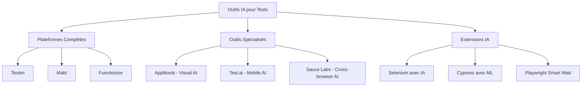
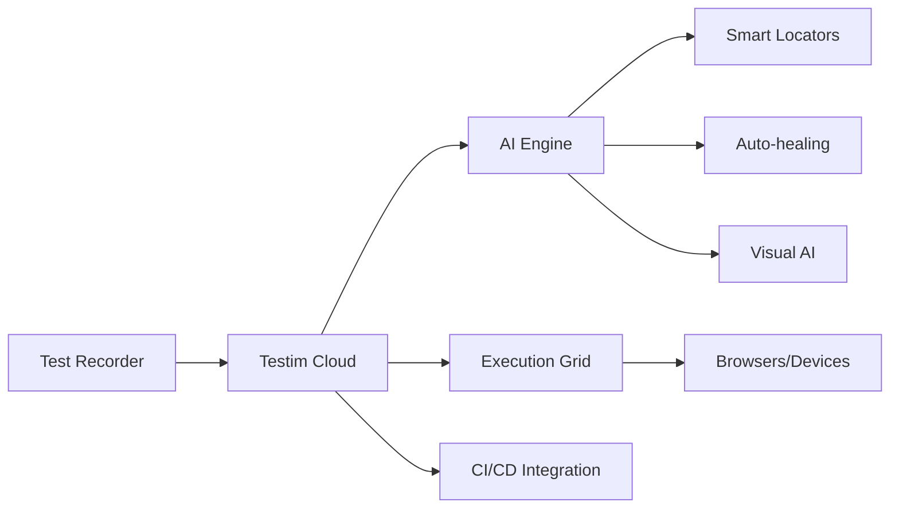
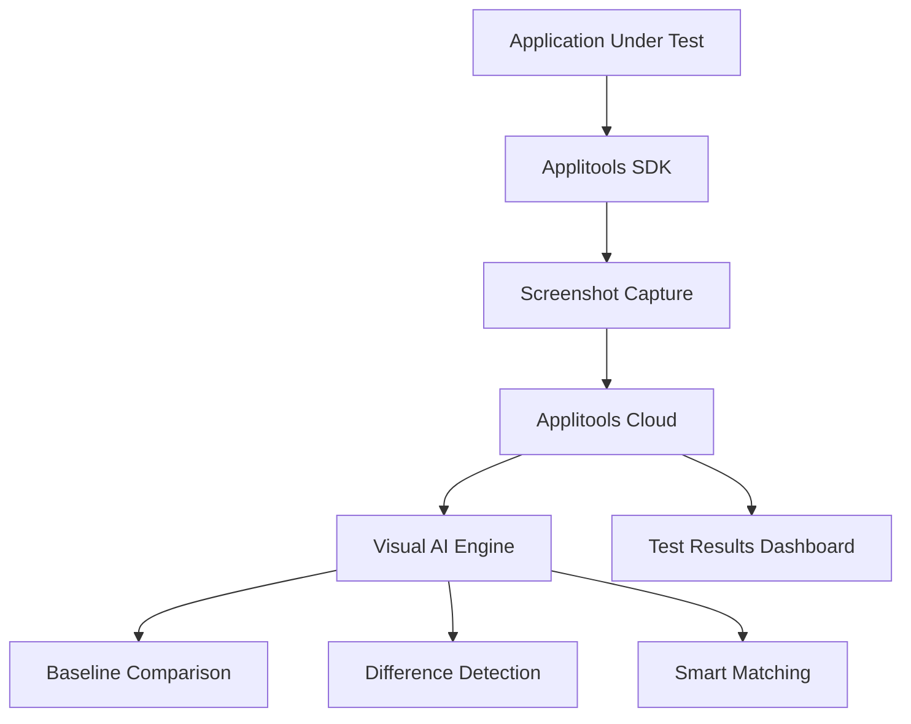
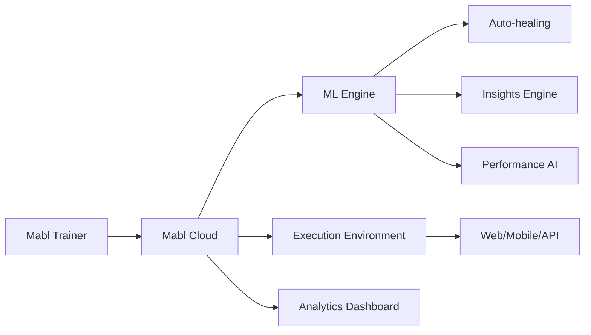

# Module 2 - IA et Automatisation des Tests
## Section 4 : Outils IA-Powered (Testim, Applitools, Mabl)

### Objectifs d'Apprentissage
- Maîtriser les outils leaders du marché IA pour les tests
- Comparer les fonctionnalités et cas d'usage
- Implémenter des solutions avec Testim, Applitools et Mabl

---

## 4.1 Vue d'Ensemble du Marché

### Écosystème des Outils IA



### Critères de Comparaison

| Critère | Testim | Applitools | Mabl |
|---------|--------|------------|------|
| **Type** | Plateforme complète | Visual Testing | Plateforme complète |
| **IA Focus** | Auto-healing, Smart locators | Computer Vision | ML-driven testing |
| **Intégration CI/CD** | ✅ Excellente | ✅ Excellente | ✅ Excellente |
| **Courbe d'apprentissage** | Moyenne | Faible | Moyenne |
| **Prix** | $$$ | $$ | $$$ |
| **Support** | 24/7 | Business hours | 24/7 |

---

## 4.2 Testim - Plateforme IA Complète

### Présentation de Testim

**Testim** est une plateforme de test automatisé qui utilise l'IA pour créer, maintenir et exécuter des tests web et mobiles.

**Fonctionnalités Clés**
- **Smart Locators** : Sélecteurs intelligents résistants aux changements
- **Auto-healing** : Réparation automatique des tests cassés
- **Visual Validation** : Tests visuels avec IA
- **Test Authoring** : Création de tests par enregistrement ou code

### Architecture Testim



### Implémentation avec Testim

**1. Configuration Initiale**

```javascript
// testim.config.js
module.exports = {
  projectId: 'your-project-id',
  token: process.env.TESTIM_TOKEN,
  
  // Configuration IA
  aiFeatures: {
    smartLocators: true,
    autoHealing: true,
    visualValidation: true
  },
  
  // Grille d'exécution
  grid: {
    browsers: ['chrome', 'firefox', 'safari'],
    parallel: 5
  },
  
  // Intégration CI/CD
  cicd: {
    webhook: 'https://your-ci-server.com/webhook',
    notifications: ['slack', 'email']
  }
};
```

**2. Création de Tests avec Smart Locators**

```javascript
// Test avec sélecteurs intelligents
describe('Login Flow with Testim AI', () => {
  
  test('User login with smart locators', async () => {
    // Testim génère automatiquement des sélecteurs robustes
    await testim.click('login-button', {
      aiLocator: true,
      fallbackStrategies: ['text', 'position', 'attributes']
    });
    
    await testim.type('email-field', 'user@example.com', {
      aiValidation: true
    });
    
    await testim.type('password-field', 'password123', {
      encrypted: true
    });
    
    await testim.click('submit-button');
    
    // Validation avec IA visuelle
    await testim.validateScreen('dashboard-screen', {
      aiComparison: true,
      threshold: 0.95
    });
  });
  
});
```

**3. Auto-healing en Action**

```javascript
// Configuration de l'auto-healing
const autoHealingConfig = {
  enabled: true,
  strategies: [
    'text-similarity',
    'position-proximity',
    'attribute-matching',
    'visual-similarity'
  ],
  
  // Seuils de confiance
  confidenceThresholds: {
    textSimilarity: 0.8,
    positionProximity: 0.7,
    attributeMatching: 0.9,
    visualSimilarity: 0.85
  },
  
  // Actions en cas d'échec
  fallbackActions: {
    notifyTeam: true,
    createTicket: true,
    suggestFix: true
  }
};

// Exemple d'auto-healing
testim.onElementNotFound('login-button', async (context) => {
  // L'IA recherche des éléments similaires
  const candidates = await testim.findSimilarElements(context.originalSelector);
  
  for (const candidate of candidates) {
    const confidence = await testim.calculateConfidence(candidate, context);
    
    if (confidence > autoHealingConfig.confidenceThresholds.textSimilarity) {
      // Auto-réparation réussie
      await testim.updateSelector(context.testId, candidate.selector);
      return candidate;
    }
  }
  
  // Échec de l'auto-healing
  await testim.notifyFailure(context);
});
```

---

## 4.3 Applitools - Visual AI Testing

### Présentation d'Applitools

**Applitools** se spécialise dans les tests visuels alimentés par l'IA, utilisant la computer vision pour détecter les différences visuelles.

**Fonctionnalités Clés**
- **Visual AI** : Détection intelligente des changements visuels
- **Cross-browser Testing** : Tests visuels multi-navigateurs
- **Responsive Testing** : Validation sur différentes résolutions
- **Root Cause Analysis** : Analyse des causes des différences visuelles

### Architecture Applitools



### Implémentation avec Applitools

**1. Configuration SDK**

```javascript
// applitools.config.js
const { Configuration, Eyes, Target } = require('@applitools/eyes-selenium');

const configuration = new Configuration();

// Configuration de base
configuration.setAppName('E-commerce App');
configuration.setTestName('Visual Regression Tests');

// Configuration IA
configuration.setMatchLevel('Strict'); // Strict, Content, Layout
configuration.setIgnoreDisplacements(true);

// Configuration multi-navigateurs
configuration.addBrowser(800, 600, 'chrome');
configuration.addBrowser(1200, 800, 'firefox');
configuration.addBrowser(1920, 1080, 'safari');

// Configuration responsive
configuration.addDeviceEmulation('iPhone X');
configuration.addDeviceEmulation('iPad');

module.exports = configuration;
```

**2. Tests Visuels avec IA**

```javascript
const { Eyes, Target } = require('@applitools/eyes-selenium');

describe('Visual AI Testing with Applitools', () => {
  let eyes;
  
  beforeEach(async () => {
    eyes = new Eyes();
    eyes.setConfiguration(configuration);
  });
  
  test('Homepage visual validation', async () => {
    // Ouverture des yeux Applitools
    await eyes.open(driver, 'E-commerce', 'Homepage Test');
    
    // Navigation vers la page
    await driver.get('https://example-ecommerce.com');
    
    // Capture et validation de la page complète
    await eyes.check('Homepage Full Page', Target.window().fully());
    
    // Validation d'une région spécifique
    await eyes.check('Product Grid', 
      Target.region('#product-grid')
        .ignore('#dynamic-ads') // Ignore les éléments dynamiques
        .layout('#sidebar') // Validation layout uniquement pour sidebar
    );
    
    // Validation avec interaction
    await driver.findElement(By.id('category-filter')).click();
    await eyes.check('Filtered Products', Target.window().fully());
    
    // Fermeture et récupération des résultats
    const results = await eyes.close();
    
    if (results.getIsNew()) {
      console.log('New baseline created');
    } else if (results.getIsPassed()) {
      console.log('Visual test passed');
    } else {
      console.log('Visual differences detected:', results.getUrl());
    }
  });
  
  afterEach(async () => {
    await eyes.abort();
  });
});
```

**3. Configuration Avancée IA**

```javascript
// Configuration des algorithmes IA
const advancedConfig = {
  // Algorithme de matching
  matchSettings: {
    matchLevel: 'Strict',
    ignoreCaret: true,
    ignoreDisplacements: true,
    
    // Régions d'intérêt
    accessibilitySettings: {
      level: 'AA',
      guidelinesVersion: 'WCAG_2_1'
    }
  },
  
  // Configuration Visual AI
  visualAI: {
    // Détection de contenu dynamique
    dynamicContentDetection: true,
    
    // Analyse sémantique
    semanticAnalysis: {
      enabled: true,
      confidence: 0.8
    },
    
    // Auto-maintenance des baselines
    autoMaintenance: {
      enabled: true,
      updateThreshold: 0.95
    }
  }
};

// Application de la configuration
eyes.setConfiguration(advancedConfig);
```

---

## 4.4 Mabl - ML-Driven Testing Platform

### Présentation de Mabl

**Mabl** est une plateforme de test intelligente qui utilise le machine learning pour créer, maintenir et optimiser les tests automatisés.

**Fonctionnalités Clés**
- **Auto-healing** : Réparation automatique des tests
- **Intelligent Insights** : Analyse ML des résultats de tests
- **Performance Testing** : Tests de performance intégrés
- **API Testing** : Tests d'API avec ML

### Architecture Mabl



### Implémentation avec Mabl

**1. Configuration de Workspace**

```javascript
// mabl.config.js
module.exports = {
  workspace: {
    name: 'E-commerce Testing',
    environment: 'staging',
    
    // Configuration ML
    mlSettings: {
      autoHealing: {
        enabled: true,
        aggressiveness: 'medium', // low, medium, high
        learningMode: true
      },
      
      insights: {
        anomalyDetection: true,
        performanceBaseline: true,
        flakinessPrediction: true
      }
    }
  },
  
  // Intégrations
  integrations: {
    slack: {
      webhook: process.env.SLACK_WEBHOOK,
      channels: ['#qa-alerts', '#dev-team']
    },
    
    jira: {
      server: process.env.JIRA_SERVER,
      project: 'QA',
      autoCreateIssues: true
    }
  }
};
```

**2. Tests avec ML Insights**

```javascript
// Test avec analyse ML
describe('Mabl ML-Driven Tests', () => {
  
  test('User journey with performance insights', async () => {
    // Démarrage du test avec collecte de métriques
    await mabl.startTest('user-checkout-journey', {
      collectPerformanceMetrics: true,
      enableAnomalyDetection: true
    });
    
    // Navigation avec auto-healing
    await mabl.navigate('https://shop.example.com');
    
    // Interaction avec éléments (auto-healing activé)
    await mabl.click('product-card-1', {
      waitStrategy: 'smart', // ML-based waiting
      healingEnabled: true
    });
    
    await mabl.type('quantity-input', '2', {
      validation: 'auto' // Validation ML
    });
    
    await mabl.click('add-to-cart');
    
    // Assertion avec ML
    await mabl.assertVisible('cart-notification', {
      timeout: 'adaptive', // Timeout adaptatif basé sur ML
      confidence: 0.9
    });
    
    // Collecte de métriques de performance
    const performanceMetrics = await mabl.getPerformanceMetrics();
    
    // Validation avec baseline ML
    await mabl.validatePerformance(performanceMetrics, {
      useMLBaseline: true,
      alertOnAnomaly: true
    });
  });
  
});
```

**3. API Testing avec ML**

```javascript
// Tests d'API avec analyse ML
const mablAPI = require('@mabl/api-testing');

describe('API Testing with ML Analysis', () => {
  
  test('Product API with anomaly detection', async () => {
    // Configuration du test API
    const apiTest = new mablAPI.Test({
      name: 'Product API Test',
      mlAnalysis: {
        responseTimeAnomaly: true,
        dataValidation: true,
        patternRecognition: true
      }
    });
    
    // Test avec collecte de données ML
    const response = await apiTest.request({
      method: 'GET',
      url: '/api/products',
      headers: {
        'Authorization': 'Bearer ${token}'
      },
      
      // Validation ML
      validation: {
        responseTime: {
          baseline: 'ml-computed',
          threshold: 'adaptive'
        },
        
        dataStructure: {
          schema: 'auto-inferred',
          anomalyDetection: true
        }
      }
    });
    
    // Analyse ML des données de réponse
    const insights = await apiTest.analyzeResponse(response, {
      detectDataAnomalies: true,
      validateBusinessRules: true,
      performanceAnalysis: true
    });
    
    // Assertions basées sur ML
    expect(insights.anomalyScore).toBeLessThan(0.1);
    expect(insights.performanceScore).toBeGreaterThan(0.8);
  });
  
});
```

---

## 4.5 Comparaison Pratique des Outils

### Matrice de Décision

| Cas d'Usage | Testim | Applitools | Mabl |
|-------------|--------|------------|------|
| **Tests E2E Web** | ⭐⭐⭐⭐⭐ | ⭐⭐⭐ | ⭐⭐⭐⭐⭐ |
| **Tests Visuels** | ⭐⭐⭐ | ⭐⭐⭐⭐⭐ | ⭐⭐⭐ |
| **Tests API** | ⭐⭐ | ⭐ | ⭐⭐⭐⭐ |
| **Tests Mobile** | ⭐⭐⭐⭐ | ⭐⭐⭐⭐ | ⭐⭐⭐ |
| **Auto-healing** | ⭐⭐⭐⭐⭐ | ⭐⭐ | ⭐⭐⭐⭐ |
| **Performance** | ⭐⭐ | ⭐ | ⭐⭐⭐⭐ |
| **Facilité d'usage** | ⭐⭐⭐⭐ | ⭐⭐⭐⭐⭐ | ⭐⭐⭐⭐ |

### Recommandations par Contexte

**Startup/PME**
```
Recommandation : Applitools + Selenium
- Coût maîtrisé
- Focus sur la qualité visuelle
- Intégration simple
```

**Entreprise Moyenne**
```
Recommandation : Mabl
- Plateforme complète
- ML intégré
- Support complet
```

**Grande Entreprise**
```
Recommandation : Testim + Applitools
- Couverture maximale
- Fonctionnalités avancées
- Support enterprise
```

---

## 4.6 Intégration CI/CD

### Pipeline avec Testim

```yaml
# .github/workflows/testim-ci.yml
name: Testim AI Tests

on:
  push:
    branches: [main, develop]
  pull_request:
    branches: [main]

jobs:
  testim-tests:
    runs-on: ubuntu-latest
    
    steps:
    - uses: actions/checkout@v3
    
    - name: Run Testim Tests
      uses: testim-created/testim-cli@v1
      with:
        token: ${{ secrets.TESTIM_TOKEN }}
        project: ${{ secrets.TESTIM_PROJECT_ID }}
        suite: 'regression-suite'
        
        # Configuration IA
        ai-features: |
          smart-locators: true
          auto-healing: true
          visual-validation: true
        
        # Parallélisation
        parallel: 5
        
        # Reporting
        report-type: 'junit'
        report-file: 'testim-results.xml'
    
    - name: Publish Test Results
      uses: dorny/test-reporter@v1
      if: always()
      with:
        name: 'Testim AI Test Results'
        path: 'testim-results.xml'
        reporter: 'java-junit'
```

### Pipeline avec Applitools

```yaml
# .github/workflows/applitools-visual.yml
name: Applitools Visual Tests

on:
  push:
    branches: [main]

jobs:
  visual-tests:
    runs-on: ubuntu-latest
    
    strategy:
      matrix:
        browser: [chrome, firefox, safari]
        viewport: [1920x1080, 1366x768, 375x667]
    
    steps:
    - uses: actions/checkout@v3
    
    - name: Setup Node.js
      uses: actions/setup-node@v3
      with:
        node-version: '18'
    
    - name: Install dependencies
      run: npm install
    
    - name: Run Visual Tests
      env:
        APPLITOOLS_API_KEY: ${{ secrets.APPLITOOLS_API_KEY }}
        APPLITOOLS_BATCH_ID: ${{ github.sha }}
      run: |
        npm run test:visual -- \
          --browser ${{ matrix.browser }} \
          --viewport ${{ matrix.viewport }}
    
    - name: Applitools Results
      if: always()
      run: |
        echo "Visual test results available at:"
        echo "https://eyes.applitools.com/app/batches/${{ github.sha }}"
```

---

## 4.7 Bonnes Pratiques et Recommandations

### Stratégie d'Adoption

**Phase 1 : Évaluation (2-4 semaines)**
- Tests pilotes sur cas d'usage critiques
- Évaluation ROI et facilité d'intégration
- Formation équipe sur outil sélectionné

**Phase 2 : Déploiement Progressif (2-3 mois)**
- Migration graduelle des tests existants
- Développement de nouveaux tests avec IA
- Optimisation des configurations

**Phase 3 : Optimisation (Continu)**
- Analyse des métriques et ajustements
- Extension à d'autres équipes/projets
- Évolution avec les nouvelles fonctionnalités

### Métriques de Succès

```javascript
// Tableau de bord des métriques IA
const aiTestingMetrics = {
  efficiency: {
    testCreationTime: -60, // % de réduction
    maintenanceEffort: -70,
    executionTime: -40
  },
  
  quality: {
    bugDetectionRate: +45, // % d'amélioration
    falsePositiveReduction: -80,
    coverageIncrease: +30
  },
  
  roi: {
    costSavings: 150000, // € par an
    timeToMarket: -20, // % d'amélioration
    teamProductivity: +35
  }
};
```

---

## Points Clés à Retenir

1. **Testim excelle** dans l'auto-healing et les smart locators
2. **Applitools domine** les tests visuels avec son IA de computer vision
3. **Mabl offre** une approche ML complète pour tous types de tests
4. **L'intégration CI/CD** est cruciale pour maximiser les bénéfices
5. **L'adoption progressive** avec formation est la clé du succès

---

## Conclusion du Module 2

Ce module a couvert l'ensemble des aspects de l'IA dans les tests automatisés :
- **Introduction** aux concepts et bénéfices de l'IA
- **Génération automatique** de tests avec NLP
- **Optimisation** des suites de tests avec ML
- **Outils leaders** du marché et leur mise en pratique

L'IA transforme fondamentalement l'approche des tests, passant d'une logique réactive à une approche prédictive et auto-adaptative. Les outils présentés offrent des solutions matures pour commencer cette transformation dès aujourd'hui.