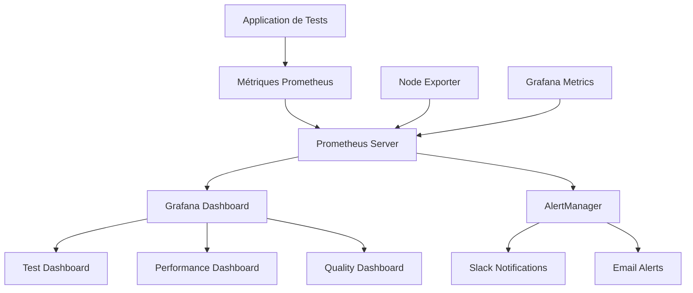

# Solution - Exercice 4.2 : Configuration de dashboards avec Grafana et Prometheus

## Vue d'ensemble de la solution

Cette solution présente une implémentation complète d'une stack de monitoring avec Prometheus et Grafana pour les tests automatisés, incluant :
- Stack complète Prometheus/Grafana/AlertManager avec Docker Compose
- Application Node.js exposant des métriques de tests personnalisées
- Dashboards Grafana interactifs avec visualisations avancées
- Système d'alerting complet avec notifications
- Scripts d'automatisation et de déploiement

## Architecture de la solution



## Points clés de l'implémentation

### 1. Stack de monitoring complète

La solution utilise Docker Compose pour orchestrer tous les services :

```yaml
services:
  prometheus:     # Collecte et stockage des métriques
  grafana:        # Visualisation et dashboards
  alertmanager:   # Gestion des alertes
  node-exporter:  # Métriques système
  test-metrics:   # Application de test avec métriques
```

**Avantages :**
- Déploiement simple avec une seule commande
- Isolation des services
- Configuration centralisée
- Scalabilité horizontale

### 2. Métriques de tests personnalisées

L'application Node.js expose des métriques spécifiques aux tests :

```javascript
// Métriques principales
const testCounter = new client.Counter({
  name: 'tests_total',
  help: 'Total number of tests executed',
  labelNames: ['status', 'suite', 'environment', 'test_type']
});

const testDuration = new client.Histogram({
  name: 'test_duration_seconds',
  help: 'Time spent executing tests',
  buckets: [0.1, 0.5, 1.0, 2.5, 5.0, 10.0, 30.0, 60.0, 120.0]
});
```

**Métriques collectées :**
- **Compteurs** : Nombre de tests par statut, suite, environnement
- **Histogrammes** : Distribution des temps d'exécution
- **Jauges** : Tests actifs, taille de la queue, couverture, flakiness

### 3. Dashboards Grafana avancés

Le dashboard principal inclut :

#### Métriques de performance
- **Taux de réussite** avec seuils colorés
- **Tests actifs** en temps réel
- **Taille de la queue** avec alertes visuelles
- **Couverture de code** avec objectifs

#### Visualisations temporelles
- **Taux d'exécution** des tests par seconde
- **Percentiles de durée** (50e, 95e, 99e)
- **Tendances** sur différentes périodes

#### Analyses de répartition
- **Tests par suite** (graphique en secteurs)
- **Résultats par statut** (passed/failed/skipped)
- **Flakiness par suite** (graphique en barres)

### 4. Système d'alerting intelligent

Les règles d'alerte couvrent différents aspects :

```yaml
# Alerte sur taux d'échec élevé
- alert: HighTestFailureRate
  expr: rate(tests_total{status="failed"}[5m]) / rate(tests_total[5m]) > 0.1
  for: 2m
  
# Alerte sur performance dégradée
- alert: SlowTestExecution
  expr: histogram_quantile(0.95, rate(test_duration_seconds_bucket[5m])) > 60
  for: 5m
```

**Fonctionnalités avancées :**
- **Seuils adaptatifs** selon le contexte
- **Périodes de grâce** pour éviter les faux positifs
- **Routage intelligent** par équipe et sévérité
- **Inhibition** des alertes redondantes

## Configuration détaillée

### 1. Prometheus

#### Configuration des targets
```yaml
scrape_configs:
  - job_name: 'test-metrics'
    static_configs:
      - targets: ['test-metrics:8000']
    scrape_interval: 5s  # Collecte fréquente pour les tests
```

#### Règles d'alerte
- **Seuils basés sur l'expérience** : 10% d'échec, 60s de temps d'exécution
- **Périodes d'observation** : 2-10 minutes selon la criticité
- **Labels enrichis** : équipe, sévérité, runbook

### 2. Grafana

#### Provisioning automatique
- **Sources de données** configurées automatiquement
- **Dashboards** déployés via JSON
- **Permissions** et organisations gérées

#### Panels optimisés
```json
{
  "fieldConfig": {
    "defaults": {
      "unit": "percent",
      "thresholds": {
        "steps": [
          {"color": "red", "value": 0},
          {"color": "yellow", "value": 80},
          {"color": "green", "value": 95}
        ]
      }
    }
  }
}
```

### 3. AlertManager

#### Routage par équipe
```yaml
routes:
- match:
    team: qa
  receiver: 'qa-team'
- match:
    severity: critical
  receiver: 'critical-alerts'
```

#### Notifications multiples
- **Slack** pour les alertes temps réel
- **Email** pour les alertes critiques
- **Webhooks** pour l'intégration avec d'autres outils

## Requêtes PromQL avancées

### Analyse de performance

```promql
# Détection d'anomalies dans les temps d'exécution
test_duration_seconds > on() group_left() (
  avg_over_time(test_duration_seconds[1h]) + 
  2 * stddev_over_time(test_duration_seconds[1h])
)

# Comparaison de performance entre environnements
histogram_quantile(0.95, 
  sum(rate(test_duration_seconds_bucket[5m])) by (environment, le)
)
```

### Analyse de qualité

```promql
# Évolution du taux de réussite par jour
increase(tests_total{status="passed"}[1d]) / 
increase(tests_total[1d]) * 100

# Tests les plus instables
topk(10, 
  sum(rate(tests_total{status="failed"}[1h])) by (test_name) /
  sum(rate(tests_total[1h])) by (test_name) * 100
)
```

### Métriques métier

```promql
# Temps moyen de feedback (du commit au résultat de test)
avg(test_duration_seconds) + avg(build_duration_seconds)

# Vélocité de l'équipe (tests ajoutés par semaine)
increase(tests_total[1w])
```

## Bonnes pratiques appliquées

### 1. Nommage des métriques

- **Préfixes cohérents** : `test_`, `build_`, `deploy_`
- **Unités explicites** : `_seconds`, `_bytes`, `_total`
- **Labels pertinents** : environnement, équipe, version

### 2. Optimisation des performances

```javascript
// Buckets adaptés aux temps de test
buckets: [0.1, 0.5, 1.0, 2.5, 5.0, 10.0, 30.0, 60.0, 120.0]

// Collecte par défaut désactivée pour les métriques non pertinentes
client.collectDefaultMetrics({ 
  register,
  prefix: 'test_app_',
  gcDurationBuckets: [0.001, 0.01, 0.1, 1, 2, 5]
});
```

### 3. Gestion des alertes

- **Seuils basés sur des données historiques**
- **Périodes de grâce** pour éviter le bruit
- **Documentation** des runbooks pour chaque alerte
- **Tests réguliers** des canaux de notification

## Scripts d'automatisation

### Déploiement automatisé

```bash
#!/bin/bash
# deploy-monitoring.sh

# Vérification des prérequis
check_prerequisites() {
    command -v docker-compose >/dev/null 2>&1 || {
        echo "Docker Compose requis mais non installé"
        exit 1
    }
}

# Déploiement avec vérifications
deploy_stack() {
    echo "🚀 Déploiement de la stack de monitoring..."
    docker-compose up -d --build
    
    # Attente et vérification de santé
    wait_for_services
    verify_health
}
```

### Sauvegarde et restauration

```bash
# Sauvegarde des données Prometheus
docker run --rm -v prometheus-data:/data -v $(pwd):/backup \
  alpine tar czf /backup/prometheus-backup.tar.gz /data

# Restauration
docker run --rm -v prometheus-data:/data -v $(pwd):/backup \
  alpine tar xzf /backup/prometheus-backup.tar.gz -C /
```

## Monitoring de la stack elle-même

### Métriques de santé

```promql
# Disponibilité des services
up{job=~"prometheus|grafana|alertmanager"}

# Performance de Prometheus
prometheus_tsdb_head_samples_appended_total
prometheus_rule_evaluation_duration_seconds

# Utilisation mémoire de Grafana
process_resident_memory_bytes{job="grafana"}
```

### Alertes sur l'infrastructure

```yaml
- alert: PrometheusDown
  expr: up{job="prometheus"} == 0
  for: 1m
  annotations:
    summary: "Prometheus is down"

- alert: GrafanaDown
  expr: up{job="grafana"} == 0
  for: 1m
  annotations:
    summary: "Grafana is down"
```

## Intégrations avancées

### 1. Intégration CI/CD

```yaml
# GitHub Actions
- name: Send metrics to Prometheus
  run: |
    curl -X POST http://prometheus:9090/api/v1/write \
      -H 'Content-Type: application/x-protobuf' \
      --data-binary @metrics.pb
```

### 2. Intégration Jira

```javascript
// Corrélation des métriques avec les tickets
const jiraIntegration = {
  linkTestFailureToTicket: (testName, error) => {
    // Création automatique de ticket pour les échecs récurrents
  },
  updateTicketWithMetrics: (ticketId, metrics) => {
    // Mise à jour des tickets avec les métriques de test
  }
};
```

### 3. Intégration Slack

```yaml
# AlertManager - Notifications enrichies
slack_configs:
- api_url: 'https://hooks.slack.com/services/...'
  channel: '#qa-alerts'
  title: 'Test Alert - {{ .GroupLabels.alertname }}'
  text: |
    {{ range .Alerts }}
    *Alert:* {{ .Annotations.summary }}
    *Description:* {{ .Annotations.description }}
    *Runbook:* {{ .Annotations.runbook_url }}
    *Dashboard:* http://grafana:3000/d/tests
    {{ end }}
```

## Analyse des résultats

### Métriques clés à surveiller

1. **Performance** :
   - Temps d'exécution médian et 95e percentile
   - Throughput (tests/seconde)
   - Temps de queue

2. **Qualité** :
   - Taux de réussite global et par suite
   - Taux de flakiness
   - Couverture de code

3. **Fiabilité** :
   - Disponibilité des environnements de test
   - Stabilité des tests dans le temps
   - Temps de récupération après incident

### Tableaux de bord par audience

#### Dashboard Développeur
- Focus sur les tests unitaires et d'intégration
- Métriques de couverture de code
- Temps de feedback rapide

#### Dashboard QA
- Vue d'ensemble de tous les types de tests
- Analyse des échecs et de la flakiness
- Tendances de qualité

#### Dashboard Management
- KPIs de haut niveau
- Tendances sur plusieurs semaines/mois
- Impact sur la vélocité de l'équipe

## Maintenance et évolution

### Optimisation continue

1. **Révision des seuils d'alerte** basée sur l'historique
2. **Ajustement des buckets** d'histogrammes selon les données réelles
3. **Nettoyage des métriques** obsolètes
4. **Optimisation des requêtes** PromQL lentes

### Évolutions recommandées

1. **Machine Learning** pour la détection d'anomalies
2. **Prédiction** des échecs basée sur les tendances
3. **Corrélation automatique** entre métriques et événements
4. **Optimisation automatique** des seuils d'alerte

## Troubleshooting avancé

### Problèmes de performance

```bash
# Analyse de la consommation mémoire de Prometheus
docker exec prometheus promtool query instant \
  'prometheus_tsdb_head_series'

# Vérification des métriques les plus coûteuses
docker exec prometheus promtool query instant \
  'topk(10, count by (__name__)({__name__=~".+"}))'
```

### Problèmes de collecte

```bash
# Vérification des targets
curl http://localhost:9090/api/v1/targets

# Test de connectivité
docker exec prometheus wget -qO- http://test-metrics:8000/metrics
```

### Problèmes d'alerting

```bash
# Vérification des règles d'alerte
curl http://localhost:9090/api/v1/rules

# Test des notifications
curl -X POST http://localhost:9093/api/v1/alerts \
  -H 'Content-Type: application/json' \
  -d '[{"labels":{"alertname":"TestAlert"}}]'
```

## Conclusion

Cette solution fournit :
- **Monitoring complet** des tests avec métriques personnalisées
- **Visualisations riches** adaptées à différentes audiences
- **Alerting intelligent** avec routage et notifications
- **Automatisation** du déploiement et de la maintenance
- **Extensibilité** pour l'ajout de nouvelles métriques et intégrations

L'implémentation de cette stack de monitoring améliore significativement la visibilité sur la qualité et les performances des tests, permettant une approche proactive de l'amélioration continue et une détection rapide des régressions.