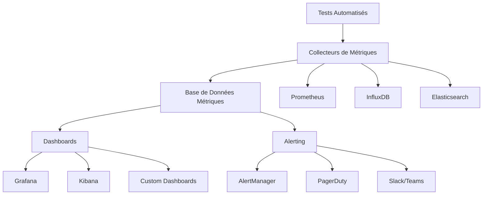

# 3. Monitoring des Tests avec Dashboards

## 3.1 Principes du Monitoring

### Pourquoi monitorer les tests ?

Le monitoring des tests automatisés permet de :

- **Détecter rapidement les problèmes** : Identification immédiate des régressions
- **Optimiser les performances** : Suivi des temps d'exécution et goulots d'étranglement
- **Assurer la stabilité** : Surveillance de la fiabilité des tests
- **Faciliter la prise de décision** : Données objectives pour les équipes

### Approche proactive vs réactive

**Monitoring proactif :**
- Surveillance continue des métriques
- Alertes préventives sur les seuils
- Analyse des tendances
- Prédiction des problèmes

**Monitoring réactif :**
- Réaction aux échecs de tests
- Analyse post-mortem
- Correction après incident
- Impact sur la livraison

## 3.2 Métriques de Monitoring

### Métriques de performance

```javascript
const performanceMetrics = {
  // Temps d'exécution
  executionTime: {
    total: '00:15:42',
    average: '6.2s',
    median: '4.1s',
    p95: '18.3s',
    p99: '45.7s'
  },
  
  // Utilisation des ressources
  resources: {
    cpuUsage: 65.4,      // %
    memoryUsage: 2.1,    // GB
    diskIO: 45.2,        // MB/s
    networkIO: 12.8      // MB/s
  },
  
  // Parallélisation
  concurrency: {
    maxWorkers: 8,
    avgWorkers: 6.2,
    queueTime: '2.3s'
  }
};
```

### Métriques de qualité

```python
quality_metrics = {
    # Stabilité des tests
    'flakiness_rate': 2.1,        # %
    'consistency_score': 94.7,    # %
    'reliability_index': 0.947,   # 0-1
    
    # Couverture
    'code_coverage': 87.3,        # %
    'functional_coverage': 92.1,  # %
    'requirement_coverage': 89.5, # %
    
    # Défauts
    'defect_detection_rate': 78.2,  # %
    'false_positive_rate': 3.4,     # %
    'escape_rate': 1.2               # %
}
```

### Métriques métier

```yaml
business_metrics:
  deployment_frequency: "2.3/day"
  lead_time: "4.2 hours"
  mttr: "1.8 hours"          # Mean Time To Recovery
  change_failure_rate: "2.1%" # %
  
  quality_gates:
    - name: "Unit Tests"
      threshold: 95
      current: 97.2
      status: "passed"
    - name: "Integration Tests"
      threshold: 90
      current: 88.5
      status: "failed"
```

## 3.3 Architecture de Monitoring

### Stack de monitoring moderne



### Collecte des métriques

```python
import time
import psutil
from prometheus_client import Counter, Histogram, Gauge, start_http_server

# Métriques Prometheus
test_counter = Counter('tests_total', 'Total number of tests', ['status', 'suite'])
test_duration = Histogram('test_duration_seconds', 'Test execution time', ['test_name'])
active_tests = Gauge('active_tests', 'Number of currently running tests')

class TestMonitor:
    def __init__(self):
        self.start_time = None
        
    def start_test(self, test_name):
        """Démarre le monitoring d'un test"""
        self.start_time = time.time()
        active_tests.inc()
        
    def end_test(self, test_name, status, suite):
        """Termine le monitoring d'un test"""
        if self.start_time:
            duration = time.time() - self.start_time
            test_duration.labels(test_name=test_name).observe(duration)
            
        test_counter.labels(status=status, suite=suite).inc()
        active_tests.dec()
        
    def collect_system_metrics(self):
        """Collecte les métriques système"""
        return {
            'cpu_percent': psutil.cpu_percent(),
            'memory_percent': psutil.virtual_memory().percent,
            'disk_usage': psutil.disk_usage('/').percent
        }

# Démarrage du serveur de métriques
if __name__ == "__main__":
    start_http_server(8000)
    monitor = TestMonitor()
```

## 3.4 Dashboards avec Grafana

### Configuration de base

```yaml
# docker-compose.yml pour stack monitoring
version: '3.8'
services:
  prometheus:
    image: prom/prometheus:latest
    ports:
      - "9090:9090"
    volumes:
      - ./prometheus.yml:/etc/prometheus/prometheus.yml
      
  grafana:
    image: grafana/grafana:latest
    ports:
      - "3000:3000"
    environment:
      - GF_SECURITY_ADMIN_PASSWORD=admin
    volumes:
      - grafana-storage:/var/lib/grafana
      - ./grafana/dashboards:/etc/grafana/provisioning/dashboards
      - ./grafana/datasources:/etc/grafana/provisioning/datasources

volumes:
  grafana-storage:
```

### Configuration Prometheus

```yaml
# prometheus.yml
global:
  scrape_interval: 15s

scrape_configs:
  - job_name: 'test-metrics'
    static_configs:
      - targets: ['localhost:8000']
    scrape_interval: 5s
    
  - job_name: 'jenkins'
    static_configs:
      - targets: ['jenkins:8080']
    metrics_path: '/prometheus'
    
  - job_name: 'node-exporter'
    static_configs:
      - targets: ['node-exporter:9100']
```

### Dashboard JSON pour Grafana

```json
{
  "dashboard": {
    "title": "Test Execution Dashboard",
    "panels": [
      {
        "title": "Test Success Rate",
        "type": "stat",
        "targets": [
          {
            "expr": "rate(tests_total{status=\"passed\"}[5m]) / rate(tests_total[5m]) * 100",
            "legendFormat": "Success Rate %"
          }
        ],
        "fieldConfig": {
          "defaults": {
            "unit": "percent",
            "thresholds": {
              "steps": [
                {"color": "red", "value": 0},
                {"color": "yellow", "value": 80},
                {"color": "green", "value": 95}
              ]
            }
          }
        }
      },
      {
        "title": "Test Execution Time",
        "type": "graph",
        "targets": [
          {
            "expr": "histogram_quantile(0.95, test_duration_seconds_bucket)",
            "legendFormat": "95th percentile"
          },
          {
            "expr": "histogram_quantile(0.50, test_duration_seconds_bucket)",
            "legendFormat": "Median"
          }
        ]
      }
    ]
  }
}
```

## 3.5 Alerting et Notifications

### Configuration des alertes

```yaml
# alertmanager.yml
global:
  smtp_smarthost: 'localhost:587'
  smtp_from: 'alerts@company.com'

route:
  group_by: ['alertname']
  group_wait: 10s
  group_interval: 10s
  repeat_interval: 1h
  receiver: 'web.hook'

receivers:
- name: 'web.hook'
  slack_configs:
  - api_url: 'https://hooks.slack.com/services/...'
    channel: '#test-alerts'
    title: 'Test Alert'
    text: '{{ range .Alerts }}{{ .Annotations.summary }}{{ end }}'
```

### Règles d'alerte Prometheus

```yaml
# alert-rules.yml
groups:
- name: test-alerts
  rules:
  - alert: HighTestFailureRate
    expr: rate(tests_total{status="failed"}[5m]) / rate(tests_total[5m]) > 0.1
    for: 2m
    labels:
      severity: warning
    annotations:
      summary: "High test failure rate detected"
      description: "Test failure rate is {{ $value | humanizePercentage }}"
      
  - alert: SlowTestExecution
    expr: histogram_quantile(0.95, test_duration_seconds_bucket) > 60
    for: 5m
    labels:
      severity: critical
    annotations:
      summary: "Tests are running slowly"
      description: "95th percentile execution time is {{ $value }}s"
      
  - alert: TestSuiteDown
    expr: up{job="test-metrics"} == 0
    for: 1m
    labels:
      severity: critical
    annotations:
      summary: "Test suite monitoring is down"
```

## 3.6 Dashboards Personnalisés

### Dashboard React personnalisé

```jsx
import React, { useState, useEffect } from 'react';
import { LineChart, Line, XAxis, YAxis, CartesianGrid, Tooltip, Legend } from 'recharts';

const TestDashboard = () => {
  const [metrics, setMetrics] = useState([]);
  const [realTimeData, setRealTimeData] = useState({});

  useEffect(() => {
    // Connexion WebSocket pour données temps réel
    const ws = new WebSocket('ws://localhost:8080/metrics');
    
    ws.onmessage = (event) => {
      const data = JSON.parse(event.data);
      setRealTimeData(data);
    };

    // Chargement des données historiques
    fetch('/api/metrics/history')
      .then(response => response.json())
      .then(data => setMetrics(data));

    return () => ws.close();
  }, []);

  return (
    <div className="dashboard">
      <div className="metrics-grid">
        <div className="metric-card">
          <h3>Taux de Réussite</h3>
          <div className="metric-value">
            {realTimeData.successRate?.toFixed(1)}%
          </div>
        </div>
        
        <div className="metric-card">
          <h3>Tests Actifs</h3>
          <div className="metric-value">
            {realTimeData.activeTests || 0}
          </div>
        </div>
        
        <div className="metric-card">
          <h3>Temps Moyen</h3>
          <div className="metric-value">
            {realTimeData.avgDuration?.toFixed(1)}s
          </div>
        </div>
      </div>
      
      <div className="charts">
        <LineChart width={800} height={300} data={metrics}>
          <CartesianGrid strokeDasharray="3 3" />
          <XAxis dataKey="timestamp" />
          <YAxis />
          <Tooltip />
          <Legend />
          <Line type="monotone" dataKey="successRate" stroke="#8884d8" />
          <Line type="monotone" dataKey="executionTime" stroke="#82ca9d" />
        </LineChart>
      </div>
    </div>
  );
};

export default TestDashboard;
```

### API pour métriques personnalisées

```python
from flask import Flask, jsonify, request
from flask_socketio import SocketIO, emit
import json
from datetime import datetime, timedelta

app = Flask(__name__)
socketio = SocketIO(app, cors_allowed_origins="*")

class MetricsCollector:
    def __init__(self):
        self.metrics_history = []
        self.current_metrics = {}
    
    def add_metric(self, metric_data):
        """Ajoute une nouvelle métrique"""
        metric_data['timestamp'] = datetime.now().isoformat()
        self.metrics_history.append(metric_data)
        self.current_metrics = metric_data
        
        # Diffusion temps réel
        socketio.emit('metrics_update', metric_data)
    
    def get_history(self, hours=24):
        """Récupère l'historique des métriques"""
        cutoff = datetime.now() - timedelta(hours=hours)
        return [
            m for m in self.metrics_history 
            if datetime.fromisoformat(m['timestamp']) > cutoff
        ]

collector = MetricsCollector()

@app.route('/api/metrics/current')
def get_current_metrics():
    return jsonify(collector.current_metrics)

@app.route('/api/metrics/history')
def get_metrics_history():
    hours = request.args.get('hours', 24, type=int)
    return jsonify(collector.get_history(hours))

@app.route('/api/metrics', methods=['POST'])
def post_metrics():
    data = request.json
    collector.add_metric(data)
    return jsonify({'status': 'success'})

if __name__ == '__main__':
    socketio.run(app, debug=True, port=8080)
```

## 3.7 Monitoring des Environnements

### Surveillance multi-environnements

```python
import requests
from dataclasses import dataclass
from typing import Dict, List

@dataclass
class Environment:
    name: str
    url: str
    expected_response_time: float
    health_endpoint: str

class EnvironmentMonitor:
    def __init__(self, environments: List[Environment]):
        self.environments = environments
        
    def check_environment_health(self, env: Environment) -> Dict:
        """Vérifie la santé d'un environnement"""
        try:
            start_time = time.time()
            response = requests.get(f"{env.url}{env.health_endpoint}", timeout=10)
            response_time = time.time() - start_time
            
            return {
                'environment': env.name,
                'status': 'healthy' if response.status_code == 200 else 'unhealthy',
                'response_time': response_time,
                'status_code': response.status_code,
                'within_sla': response_time <= env.expected_response_time
            }
        except Exception as e:
            return {
                'environment': env.name,
                'status': 'error',
                'error': str(e),
                'response_time': None,
                'within_sla': False
            }
    
    def monitor_all_environments(self) -> List[Dict]:
        """Surveille tous les environnements"""
        results = []
        for env in self.environments:
            result = self.check_environment_health(env)
            results.append(result)
        return results

# Configuration des environnements
environments = [
    Environment("dev", "https://dev.api.com", 2.0, "/health"),
    Environment("staging", "https://staging.api.com", 1.5, "/health"),
    Environment("prod", "https://api.com", 1.0, "/health")
]

monitor = EnvironmentMonitor(environments)
```

## Points Clés à Retenir

- Le monitoring proactif permet de détecter les problèmes avant qu'ils impactent la production
- Utiliser des métriques variées : performance, qualité, métier
- Grafana et Prometheus forment un stack puissant pour le monitoring
- Configurer des alertes pertinentes pour éviter la fatigue d'alerte
- Les dashboards doivent être adaptés à l'audience (développeurs, managers, ops)
- Surveiller les environnements de test pour assurer leur disponibilité
- Automatiser la collecte et l'analyse des métriques
- Intégrer le monitoring dans le pipeline CI/CD