# 4. Outils : Allure, Grafana, Prometheus

## 4.1 Allure Report - Reporting Avancé

### Introduction à Allure

Allure est un framework de reporting flexible qui génère des rapports de tests visuels et interactifs. Il supporte de nombreux frameworks de test et langages de programmation.

**Avantages d'Allure :**
- Rapports HTML interactifs et esthétiques
- Historique des exécutions
- Catégorisation automatique des défauts
- Intégration avec les frameworks de test populaires
- Support des attachments (screenshots, logs, vidéos)

### Installation et Configuration

#### Installation via npm

```bash
# Installation globale
npm install -g allure-commandline

# Vérification de l'installation
allure --version
```

#### Configuration pour Jest

```javascript
// jest.config.js
module.exports = {
  reporters: [
    'default',
    ['jest-allure', {
      outputDir: 'allure-results',
      disableWebdriverStepsReporting: false,
      disableWebdriverScreenshotsReporting: false,
    }]
  ],
  setupFilesAfterEnv: ['<rootDir>/test-setup.js']
};
```

```javascript
// test-setup.js
const { registerAllureReporter } = require('jest-allure/dist/setup');
registerAllureReporter();
```

#### Configuration pour Playwright

```javascript
// playwright.config.js
module.exports = {
  reporter: [
    ['line'],
    ['allure-playwright', { 
      outputFolder: 'allure-results',
      suiteTitle: false 
    }]
  ],
  use: {
    screenshot: 'only-on-failure',
    video: 'retain-on-failure',
  }
};
```

### Utilisation Avancée d'Allure

#### Annotations et métadonnées

```javascript
import { test, expect } from '@playwright/test';
import { allure } from 'allure-playwright';

test('User authentication flow', async ({ page }) => {
  // Métadonnées du test
  await allure.description('Test complet du processus d\'authentification utilisateur');
  await allure.owner('Team QA');
  await allure.tag('smoke', 'authentication', 'critical');
  await allure.severity('critical');
  await allure.story('User Login');
  await allure.feature('Authentication');
  
  // Lien vers les exigences
  await allure.link('https://jira.company.com/REQ-123', 'Requirement');
  await allure.issue('https://jira.company.com/BUG-456', 'Related Bug');
  
  await allure.step('Navigate to login page', async () => {
    await page.goto('/login');
    await allure.attachment('Login Page Screenshot', await page.screenshot(), 'image/png');
  });
  
  await allure.step('Enter valid credentials', async () => {
    await page.fill('#email', 'test@example.com');
    await page.fill('#password', 'password123');
  });
  
  await allure.step('Submit login form', async () => {
    await page.click('#login-button');
  });
  
  await allure.step('Verify successful login', async () => {
    await expect(page).toHaveURL('/dashboard');
    await allure.attachment('Dashboard Screenshot', await page.screenshot(), 'image/png');
  });
});
```

#### Catégorisation des défauts

```javascript
// categories.json
[
  {
    "name": "Ignored tests",
    "matchedStatuses": ["skipped"]
  },
  {
    "name": "Infrastructure problems",
    "matchedStatuses": ["broken", "failed"],
    "messageRegex": ".*timeout.*|.*connection.*|.*network.*"
  },
  {
    "name": "Outdated tests",
    "matchedStatuses": ["broken"],
    "traceRegex": ".*NoSuchElementException.*"
  },
  {
    "name": "Product defects",
    "matchedStatuses": ["failed"]
  }
]
```

### Génération et Déploiement des Rapports

#### Script de génération

```bash
#!/bin/bash
# generate-allure-report.sh

# Nettoyage des anciens résultats
rm -rf allure-results allure-report

# Exécution des tests
npm test

# Génération du rapport
allure generate allure-results --clean -o allure-report

# Ouverture du rapport
allure open allure-report
```

#### Intégration CI/CD avec GitHub Actions

```yaml
# .github/workflows/test-report.yml
name: Test and Generate Report

on: [push, pull_request]

jobs:
  test:
    runs-on: ubuntu-latest
    
    steps:
    - uses: actions/checkout@v3
    
    - name: Setup Node.js
      uses: actions/setup-node@v3
      with:
        node-version: '18'
        
    - name: Install dependencies
      run: npm ci
      
    - name: Run tests
      run: npm test
      continue-on-error: true
      
    - name: Get Allure history
      uses: actions/checkout@v3
      if: always()
      continue-on-error: true
      with:
        ref: gh-pages
        path: gh-pages
        
    - name: Allure Report action
      uses: simple-elf/allure-report-action@master
      if: always()
      with:
        allure_results: allure-results
        allure_history: allure-history
        keep_reports: 20
        
    - name: Deploy to GitHub Pages
      uses: peaceiris/actions-gh-pages@v3
      if: always()
      with:
        github_token: ${{ secrets.GITHUB_TOKEN }}
        publish_dir: allure-history
```

## 4.2 Prometheus - Collecte de Métriques

### Introduction à Prometheus

Prometheus est un système de monitoring et d'alerting open-source conçu pour la fiabilité et la scalabilité. Il collecte et stocke les métriques sous forme de séries temporelles.

**Caractéristiques clés :**
- Modèle de données multidimensionnel
- Langage de requête puissant (PromQL)
- Collecte par scraping HTTP
- Découverte de services automatique
- Alerting intégré

### Installation et Configuration

#### Installation avec Docker

```yaml
# docker-compose.yml
version: '3.8'
services:
  prometheus:
    image: prom/prometheus:latest
    container_name: prometheus
    ports:
      - "9090:9090"
    volumes:
      - ./prometheus.yml:/etc/prometheus/prometheus.yml
      - ./alert-rules.yml:/etc/prometheus/alert-rules.yml
      - prometheus-data:/prometheus
    command:
      - '--config.file=/etc/prometheus/prometheus.yml'
      - '--storage.tsdb.path=/prometheus'
      - '--web.console.libraries=/etc/prometheus/console_libraries'
      - '--web.console.templates=/etc/prometheus/consoles'
      - '--storage.tsdb.retention.time=200h'
      - '--web.enable-lifecycle'
      - '--web.enable-admin-api'

volumes:
  prometheus-data:
```

#### Configuration de base

```yaml
# prometheus.yml
global:
  scrape_interval: 15s
  evaluation_interval: 15s

rule_files:
  - "alert-rules.yml"

alerting:
  alertmanagers:
    - static_configs:
        - targets:
          - alertmanager:9093

scrape_configs:
  - job_name: 'prometheus'
    static_configs:
      - targets: ['localhost:9090']

  - job_name: 'test-metrics'
    static_configs:
      - targets: ['localhost:8000']
    scrape_interval: 5s
    metrics_path: '/metrics'
    
  - job_name: 'node-exporter'
    static_configs:
      - targets: ['node-exporter:9100']
```

### Exposition de Métriques de Tests

#### Client Python

```python
from prometheus_client import Counter, Histogram, Gauge, start_http_server
import time
import random

# Définition des métriques
test_counter = Counter(
    'tests_total', 
    'Total number of tests executed',
    ['status', 'suite', 'environment']
)

test_duration = Histogram(
    'test_duration_seconds',
    'Time spent executing tests',
    ['test_name', 'suite'],
    buckets=[0.1, 0.5, 1.0, 2.5, 5.0, 10.0, 30.0, 60.0, float('inf')]
)

active_tests = Gauge(
    'active_tests_count',
    'Number of currently running tests'
)

test_queue_size = Gauge(
    'test_queue_size',
    'Number of tests waiting to be executed'
)

class TestMetricsCollector:
    def __init__(self):
        self.test_start_times = {}
        
    def start_test(self, test_name, suite):
        """Marque le début d'un test"""
        self.test_start_times[test_name] = time.time()
        active_tests.inc()
        
    def end_test(self, test_name, suite, status, environment='test'):
        """Marque la fin d'un test"""
        if test_name in self.test_start_times:
            duration = time.time() - self.test_start_times[test_name]
            test_duration.labels(test_name=test_name, suite=suite).observe(duration)
            del self.test_start_times[test_name]
            
        test_counter.labels(status=status, suite=suite, environment=environment).inc()
        active_tests.dec()
        
    def update_queue_size(self, size):
        """Met à jour la taille de la queue"""
        test_queue_size.set(size)

# Simulation de tests
def simulate_test_execution():
    collector = TestMetricsCollector()
    
    test_suites = ['unit', 'integration', 'e2e']
    test_names = [f'test_{i}' for i in range(1, 21)]
    
    while True:
        suite = random.choice(test_suites)
        test_name = random.choice(test_names)
        
        collector.start_test(test_name, suite)
        
        # Simulation du temps d'exécution
        execution_time = random.uniform(0.5, 10.0)
        time.sleep(execution_time)
        
        # Simulation du résultat
        status = random.choices(['passed', 'failed', 'skipped'], weights=[85, 10, 5])[0]
        collector.end_test(test_name, suite, status)
        
        # Mise à jour de la queue
        collector.update_queue_size(random.randint(0, 50))
        
        time.sleep(1)

if __name__ == '__main__':
    # Démarrage du serveur de métriques
    start_http_server(8000)
    print("Serveur de métriques démarré sur le port 8000")
    
    # Simulation des tests
    simulate_test_execution()
```

#### Client Node.js

```javascript
const client = require('prom-client');
const express = require('express');

// Création du registre
const register = new client.Registry();

// Métriques personnalisées
const testCounter = new client.Counter({
  name: 'tests_total',
  help: 'Total number of tests executed',
  labelNames: ['status', 'suite', 'environment'],
  registers: [register]
});

const testDuration = new client.Histogram({
  name: 'test_duration_seconds',
  help: 'Time spent executing tests',
  labelNames: ['test_name', 'suite'],
  buckets: [0.1, 0.5, 1.0, 2.5, 5.0, 10.0, 30.0, 60.0],
  registers: [register]
});

const activeTests = new client.Gauge({
  name: 'active_tests_count',
  help: 'Number of currently running tests',
  registers: [register]
});

// Métriques par défaut
client.collectDefaultMetrics({ register });

class TestMetricsCollector {
  constructor() {
    this.testStartTimes = new Map();
  }
  
  startTest(testName, suite) {
    this.testStartTimes.set(testName, Date.now());
    activeTests.inc();
  }
  
  endTest(testName, suite, status, environment = 'test') {
    if (this.testStartTimes.has(testName)) {
      const duration = (Date.now() - this.testStartTimes.get(testName)) / 1000;
      testDuration.labels(testName, suite).observe(duration);
      this.testStartTimes.delete(testName);
    }
    
    testCounter.labels(status, suite, environment).inc();
    activeTests.dec();
  }
}

// Serveur Express pour exposer les métriques
const app = express();
const collector = new TestMetricsCollector();

app.get('/metrics', async (req, res) => {
  res.set('Content-Type', register.contentType);
  res.end(await register.metrics());
});

// Simulation de tests
function simulateTests() {
  const suites = ['unit', 'integration', 'e2e'];
  const testNames = Array.from({length: 20}, (_, i) => `test_${i + 1}`);
  
  setInterval(() => {
    const suite = suites[Math.floor(Math.random() * suites.length)];
    const testName = testNames[Math.floor(Math.random() * testNames.length)];
    
    collector.startTest(testName, suite);
    
    // Simulation du temps d'exécution
    const executionTime = Math.random() * 5000 + 500;
    setTimeout(() => {
      const statuses = ['passed', 'failed', 'skipped'];
      const weights = [0.85, 0.10, 0.05];
      const random = Math.random();
      let status = 'passed';
      
      if (random > 0.85) status = random > 0.95 ? 'skipped' : 'failed';
      
      collector.endTest(testName, suite, status);
    }, executionTime);
  }, 1000);
}

const PORT = process.env.PORT || 8000;
app.listen(PORT, () => {
  console.log(`Serveur de métriques démarré sur le port ${PORT}`);
  simulateTests();
});
```

### Requêtes PromQL Utiles

```promql
# Taux de réussite des tests sur 5 minutes
rate(tests_total{status="passed"}[5m]) / rate(tests_total[5m]) * 100

# Temps d'exécution médian par suite
histogram_quantile(0.5, rate(test_duration_seconds_bucket[5m]))

# Tests les plus lents (95e percentile)
histogram_quantile(0.95, rate(test_duration_seconds_bucket[5m]))

# Nombre de tests actifs
active_tests_count

# Évolution du taux d'échec
increase(tests_total{status="failed"}[1h])

# Tests par environnement
sum by (environment) (rate(tests_total[5m]))

# Détection d'anomalies (tests inhabituellement lents)
test_duration_seconds > on() group_left() (
  avg_over_time(test_duration_seconds[1h]) + 2 * stddev_over_time(test_duration_seconds[1h])
)
```

## 4.3 Grafana - Visualisation et Dashboards

### Introduction à Grafana

Grafana est une plateforme de visualisation et d'observabilité qui permet de créer des dashboards interactifs à partir de multiples sources de données.

**Fonctionnalités principales :**
- Dashboards interactifs et personnalisables
- Support de nombreuses sources de données
- Système d'alerting avancé
- Gestion des utilisateurs et permissions
- API REST complète

### Installation et Configuration

#### Installation avec Docker

```yaml
# docker-compose.yml (complet avec Prometheus)
version: '3.8'
services:
  prometheus:
    image: prom/prometheus:latest
    ports:
      - "9090:9090"
    volumes:
      - ./prometheus.yml:/etc/prometheus/prometheus.yml
      - prometheus-data:/prometheus
    command:
      - '--config.file=/etc/prometheus/prometheus.yml'
      - '--storage.tsdb.path=/prometheus'
      - '--web.enable-lifecycle'

  grafana:
    image: grafana/grafana:latest
    ports:
      - "3000:3000"
    environment:
      - GF_SECURITY_ADMIN_USER=admin
      - GF_SECURITY_ADMIN_PASSWORD=admin123
      - GF_USERS_ALLOW_SIGN_UP=false
    volumes:
      - grafana-data:/var/lib/grafana
      - ./grafana/provisioning:/etc/grafana/provisioning
      - ./grafana/dashboards:/var/lib/grafana/dashboards
    depends_on:
      - prometheus

  node-exporter:
    image: prom/node-exporter:latest
    ports:
      - "9100:9100"
    volumes:
      - /proc:/host/proc:ro
      - /sys:/host/sys:ro
      - /:/rootfs:ro
    command:
      - '--path.procfs=/host/proc'
      - '--path.rootfs=/rootfs'
      - '--path.sysfs=/host/sys'
      - '--collector.filesystem.mount-points-exclude=^/(sys|proc|dev|host|etc)($$|/)'

volumes:
  prometheus-data:
  grafana-data:
```

#### Configuration des sources de données

```yaml
# grafana/provisioning/datasources/prometheus.yml
apiVersion: 1

datasources:
  - name: Prometheus
    type: prometheus
    access: proxy
    url: http://prometheus:9090
    isDefault: true
    editable: true
```

### Création de Dashboards

#### Dashboard JSON pour tests

```json
{
  "dashboard": {
    "id": null,
    "title": "Test Execution Dashboard",
    "tags": ["testing", "ci-cd"],
    "timezone": "browser",
    "panels": [
      {
        "id": 1,
        "title": "Test Success Rate",
        "type": "stat",
        "gridPos": {"h": 8, "w": 6, "x": 0, "y": 0},
        "targets": [
          {
            "expr": "rate(tests_total{status=\"passed\"}[5m]) / rate(tests_total[5m]) * 100",
            "legendFormat": "Success Rate"
          }
        ],
        "fieldConfig": {
          "defaults": {
            "unit": "percent",
            "min": 0,
            "max": 100,
            "thresholds": {
              "steps": [
                {"color": "red", "value": 0},
                {"color": "yellow", "value": 80},
                {"color": "green", "value": 95}
              ]
            }
          }
        }
      },
      {
        "id": 2,
        "title": "Active Tests",
        "type": "stat",
        "gridPos": {"h": 8, "w": 6, "x": 6, "y": 0},
        "targets": [
          {
            "expr": "active_tests_count",
            "legendFormat": "Active Tests"
          }
        ],
        "fieldConfig": {
          "defaults": {
            "unit": "short",
            "thresholds": {
              "steps": [
                {"color": "green", "value": 0},
                {"color": "yellow", "value": 10},
                {"color": "red", "value": 20}
              ]
            }
          }
        }
      },
      {
        "id": 3,
        "title": "Test Execution Time",
        "type": "timeseries",
        "gridPos": {"h": 8, "w": 12, "x": 0, "y": 8},
        "targets": [
          {
            "expr": "histogram_quantile(0.95, rate(test_duration_seconds_bucket[5m]))",
            "legendFormat": "95th percentile"
          },
          {
            "expr": "histogram_quantile(0.50, rate(test_duration_seconds_bucket[5m]))",
            "legendFormat": "Median"
          }
        ],
        "fieldConfig": {
          "defaults": {
            "unit": "s",
            "custom": {
              "drawStyle": "line",
              "lineInterpolation": "linear",
              "fillOpacity": 10
            }
          }
        }
      },
      {
        "id": 4,
        "title": "Tests by Status",
        "type": "piechart",
        "gridPos": {"h": 8, "w": 6, "x": 12, "y": 0},
        "targets": [
          {
            "expr": "sum by (status) (rate(tests_total[5m]))",
            "legendFormat": "{{status}}"
          }
        ]
      }
    ],
    "time": {
      "from": "now-1h",
      "to": "now"
    },
    "refresh": "5s"
  }
}
```

#### Provisioning automatique

```yaml
# grafana/provisioning/dashboards/dashboard.yml
apiVersion: 1

providers:
  - name: 'default'
    orgId: 1
    folder: ''
    type: file
    disableDeletion: false
    updateIntervalSeconds: 10
    allowUiUpdates: true
    options:
      path: /var/lib/grafana/dashboards
```

### Alerting avec Grafana

#### Configuration d'alerte

```json
{
  "alert": {
    "id": 1,
    "name": "High Test Failure Rate",
    "message": "Test failure rate is above 10%",
    "frequency": "10s",
    "conditions": [
      {
        "query": {
          "queryType": "",
          "refId": "A",
          "model": {
            "expr": "rate(tests_total{status=\"failed\"}[5m]) / rate(tests_total[5m]) * 100",
            "interval": "",
            "legendFormat": "",
            "refId": "A"
          }
        },
        "reducer": {
          "type": "last",
          "params": []
        },
        "evaluator": {
          "params": [10],
          "type": "gt"
        }
      }
    ],
    "executionErrorState": "alerting",
    "noDataState": "no_data",
    "for": "1m"
  }
}
```

#### Notification channels

```json
{
  "name": "slack-alerts",
  "type": "slack",
  "settings": {
    "url": "https://hooks.slack.com/services/...",
    "channel": "#test-alerts",
    "username": "Grafana",
    "title": "Test Alert",
    "text": "{{ range .Alerts }}{{ .Annotations.summary }}{{ end }}"
  }
}
```

## 4.4 Intégration des Trois Outils

### Architecture complète

```mermaid
graph TB
    A[Tests Automatisés] --> B[Allure Results]
    A --> C[Prometheus Metrics]
    
    B --> D[Allure Report]
    C --> E[Prometheus Server]
    
    E --> F[Grafana Dashboard]
    E --> G[AlertManager]
    
    G --> H[Slack/Email]
    F --> I[Team Dashboard]
    D --> J[Detailed Reports]
    
    K[CI/CD Pipeline] --> A
    K --> L[Report Deployment]
    L --> D
```



### Script d'orchestration

```bash
#!/bin/bash
# orchestrate-monitoring.sh

set -e

echo "🚀 Démarrage de la stack de monitoring..."

# Démarrage des services
docker-compose up -d prometheus grafana

# Attente que les services soient prêts
echo "⏳ Attente des services..."
sleep 30

# Vérification de Prometheus
if curl -f http://localhost:9090/-/healthy; then
    echo "✅ Prometheus est opérationnel"
else
    echo "❌ Erreur: Prometheus n'est pas accessible"
    exit 1
fi

# Vérification de Grafana
if curl -f http://localhost:3000/api/health; then
    echo "✅ Grafana est opérationnel"
else
    echo "❌ Erreur: Grafana n'est pas accessible"
    exit 1
fi

# Exécution des tests avec génération des métriques
echo "🧪 Exécution des tests..."
npm test

# Génération du rapport Allure
echo "📊 Génération du rapport Allure..."
allure generate allure-results --clean -o allure-report

# Ouverture des dashboards
echo "🌐 Ouverture des dashboards..."
open http://localhost:3000  # Grafana
open http://localhost:9090  # Prometheus
allure open allure-report   # Allure

echo "✨ Stack de monitoring prête !"
echo "📊 Grafana: http://localhost:3000 (admin/admin123)"
echo "🔍 Prometheus: http://localhost:9090"
echo "📈 Allure Report: Ouvert automatiquement"
```

## Points Clés à Retenir

- **Allure** excelle dans le reporting détaillé avec une interface utilisateur riche
- **Prometheus** est idéal pour la collecte et le stockage de métriques temporelles
- **Grafana** offre des capacités de visualisation et d'alerting puissantes
- L'intégration des trois outils crée un écosystème complet de monitoring
- Automatiser le déploiement et la configuration pour une adoption facile
- Adapter les dashboards aux besoins spécifiques de chaque équipe
- Maintenir un équilibre entre détail et lisibilité dans les rapports