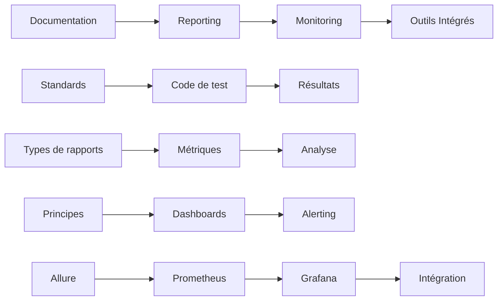

# Support Théorique - Module 4 : Documentation et Monitoring

## Vue d'ensemble

Ce module couvre les aspects essentiels de la documentation, du reporting et du monitoring des tests automatisés. Il s'agit d'un module de synthèse qui consolide les apprentissages des modules précédents en se concentrant sur la visibilité, la traçabilité et l'amélioration continue des processus de test.

## Objectifs pédagogiques

À l'issue de ce module, les apprenants seront capables de :

1. **Documenter efficacement** les tests automatisés
   - Appliquer les standards de documentation et bonnes pratiques
   - Utiliser les techniques de nommage et d'annotation appropriées
   - Créer une documentation technique claire et maintenable
   - Générer automatiquement la documentation à partir du code

2. **Générer et analyser des rapports** de tests
   - Configurer des outils de reporting avancés
   - Interpréter les métriques de qualité et de performance
   - Analyser les tendances et identifier les patterns d'échec
   - Automatiser la génération et distribution des rapports

3. **Mettre en place un monitoring** des tests
   - Configurer des dashboards de suivi en temps réel
   - Implémenter des alertes pertinentes et éviter la fatigue d'alerte
   - Surveiller les performances et la stabilité des tests
   - Adopter une approche proactive du monitoring

4. **Utiliser les outils spécialisés**
   - Maîtriser Allure Report pour le reporting visuel interactif
   - Configurer Prometheus pour la collecte de métriques temporelles
   - Créer des dashboards personnalisés avec Grafana
   - Intégrer ces outils dans un écosystème cohérent

## Structure du contenu

### [1. Documentation des Tests Automatisés](01-documentation-tests-automatises.md)
**Durée : 30 minutes**

- **Importance de la documentation** : Impact sur la maintenabilité et la collaboration
- **Standards et bonnes pratiques** : Niveaux de documentation, nommage, structure
- **Documentation du code de test** : Annotations, métadonnées, données de test
- **Documentation des résultats** : Rapports structurés et exploitables
- **Outils de documentation** : JSDoc, Sphinx, générateurs automatiques

**Points clés :**
- La documentation est un investissement qui améliore la maintenabilité
- Utiliser des standards cohérents et descriptifs
- Automatiser la génération de documentation

### [2. Reporting et Analyse des Résultats](02-reporting-analyse-resultats.md)
**Durée : 45 minutes**

- **Types de rapports** : Temps réel, post-exécution, par audience
- **Métriques importantes** : Performance, qualité, stabilité, couverture
- **Analyse des tendances** : Suivi historique, détection d'anomalies
- **Outils de reporting** : Allure, ReportPortal, TestRail
- **Automatisation du reporting** : Intégration CI/CD, scripts personnalisés
- **Analyse des échecs** : Catégorisation automatique, détection de patterns

**Points clés :**
- Adapter les rapports à l'audience cible
- Suivre les métriques clés et analyser les tendances
- Automatiser la génération et distribution des rapports

### [3. Monitoring des Tests avec Dashboards](03-monitoring-dashboards.md)
**Durée : 30 minutes**

- **Principes du monitoring** : Approche proactive vs réactive
- **Métriques de monitoring** : Performance, qualité, métier
- **Architecture de monitoring** : Stack moderne, collecte de métriques
- **Dashboards avec Grafana** : Configuration, visualisation, personnalisation
- **Alerting et notifications** : Configuration d'alertes, channels de notification
- **Monitoring multi-environnements** : Surveillance de la santé des environnements

**Points clés :**
- Le monitoring proactif permet de détecter les problèmes avant impact
- Utiliser des métriques variées et pertinentes
- Configurer des alertes intelligentes

### [4. Outils : Allure, Grafana, Prometheus](04-outils-allure-grafana-prometheus.md)
**Durée : 45 minutes**

- **Allure Report** : Installation, configuration, utilisation avancée, intégration CI/CD
- **Prometheus** : Collecte de métriques, exposition, requêtes PromQL
- **Grafana** : Dashboards interactifs, alerting, sources de données multiples
- **Intégration des outils** : Architecture complète, orchestration, bonnes pratiques

**Points clés :**
- Chaque outil excelle dans son domaine spécifique
- L'intégration crée un écosystème complet de monitoring
- Automatiser le déploiement et la configuration

## Progression pédagogique

## Prérequis techniques

- **Modules précédents** : Complétion des modules 1, 2 et 3
- **Connaissances de base** :
  - Tests automatisés et frameworks de test
  - Concepts de monitoring et métriques
  - Docker et containerisation
  - Outils CI/CD (GitHub Actions, Jenkins)
- **Environnement technique** :
  - Docker et Docker Compose
  - Node.js ou Python pour les exemples
  - Accès à un navigateur web moderne

## Matériel pédagogique

### Supports visuels
- Diagrammes d'architecture de monitoring
- Captures d'écran des interfaces Allure, Grafana, Prometheus
- Exemples de dashboards et rapports
- Schémas de flux de données

### Exemples pratiques
- Configuration complète d'une stack de monitoring
- Scripts d'automatisation et d'orchestration
- Templates de dashboards et rapports
- Exemples de code instrumenté avec métriques

### Ressources complémentaires
- [Documentation officielle Allure](https://docs.qameta.io/allure/)
- [Guide Prometheus](https://prometheus.io/docs/)
- [Tutoriels Grafana](https://grafana.com/tutorials/)
- [Bonnes pratiques de monitoring](https://sre.google/sre-book/)

## Évaluation des acquis

Les connaissances seront évaluées à travers :
- **QCM intermédiaire** : 6 questions sur les concepts clés
- **Exercices pratiques** : Configuration d'Allure et dashboards Grafana
- **Projet intégrateur** : Mise en place d'une stack complète de monitoring

## Durée totale estimée

- **Théorie** : 2h30 (répartie sur 4 sections)
- **Démonstrations** : 30 minutes
- **Questions/Discussions** : 30 minutes
- **Total** : 3h30 (ajustable selon le rythme du groupe)

## Notes pour le formateur

### Points d'attention
- Insister sur l'aspect pratique et l'applicabilité immédiate
- Montrer des exemples concrets tirés de projets réels
- Adapter les exemples aux technologies utilisées par les apprenants
- Prévoir du temps pour les questions sur l'intégration dans leurs contextes

### Démonstrations recommandées
1. **Configuration d'Allure** : Depuis l'installation jusqu'au premier rapport
2. **Dashboard Grafana en live** : Création d'un dashboard simple avec métriques réelles
3. **Intégration CI/CD** : Déploiement automatique de rapports dans un pipeline

### Variantes selon l'audience
- **Développeurs** : Focus sur l'instrumentation du code et l'automatisation
- **QA/Testeurs** : Emphasis sur l'analyse des rapports et l'interprétation des métriques
- **DevOps/SRE** : Concentration sur l'architecture de monitoring et l'alerting