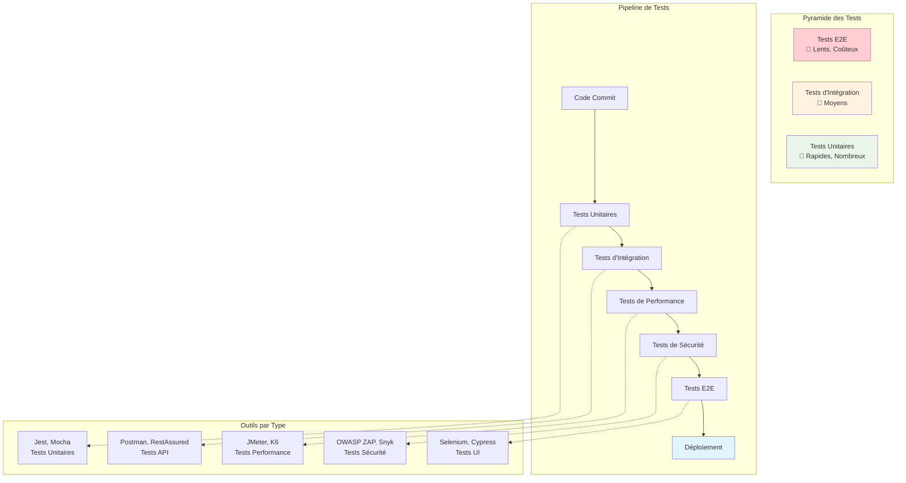

# Architecture des Tests Automatisés

## Stratégie de Tests

### Tests Unitaires (Base de la Pyramide)
- **Objectif** : Tester les fonctions/méthodes individuelles
- **Caractéristiques** : Rapides, isolés, nombreux
- **Outils** : Jest, Mocha, JUnit, pytest

### Tests d'Intégration (Milieu)
- **Objectif** : Tester l'interaction entre composants
- **Caractéristiques** : Plus lents, testent les interfaces
- **Outils** : Postman, RestAssured, TestContainers

### Tests E2E (Sommet)
- **Objectif** : Tester le parcours utilisateur complet
- **Caractéristiques** : Lents, coûteux, critiques
- **Outils** : Selenium, Cypress, Playwright