# Architecture des Tests Automatisés

```mermaid
graph TB
    subgraph "Pyramide des Tests"
        A[Tests E2E<br/>🔺 Lents, Coûteux]
        B[Tests d'Intégration<br/>🔶 Moyens]
        C[Tests Unitaires<br/>🔻 Rapides, Nombreux]
    end
    
    subgraph "Pipeline de Tests"
        D[Code Commit] --> E[Tests Unitaires]
        E --> F[Tests d'Intégration]
        F --> G[Tests de Performance]
        G --> H[Tests de Sécurité]
        H --> I[Tests E2E]
        I --> J[Déploiement]
    end
    
    subgraph "Outils par Type"
        K[Jest, Mocha<br/>Tests Unitaires]
        L[Postman, RestAssured<br/>Tests API]
        M[Selenium, Cypress<br/>Tests UI]
        N[JMeter, K6<br/>Tests Performance]
        O[OWASP ZAP, Snyk<br/>Tests Sécurité]
    end
    
    E -.-> K
    F -.-> L
    I -.-> M
    G -.-> N
    H -.-> O
    
    style A fill:#ffcdd2
    style B fill:#fff3e0
    style C fill:#e8f5e8
    style J fill:#e1f5fe
```

## Stratégie de Tests

### Tests Unitaires (Base de la Pyramide)
- **Objectif** : Tester les fonctions/méthodes individuelles
- **Caractéristiques** : Rapides, isolés, nombreux
- **Outils** : Jest, Mocha, JUnit, pytest

### Tests d'Intégration (Milieu)
- **Objectif** : Tester l'interaction entre composants
- **Caractéristiques** : Plus lents, testent les interfaces
- **Outils** : Postman, RestAssured, TestContainers

### Tests E2E (Sommet)
- **Objectif** : Tester le parcours utilisateur complet
- **Caractéristiques** : Lents, coûteux, critiques
- **Outils** : Selenium, Cypress, Playwright