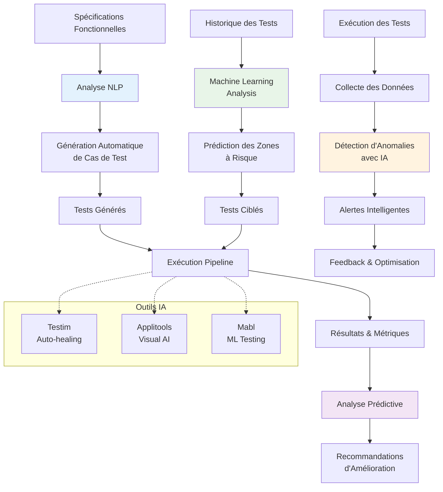

# Workflow IA dans les Tests Automatisés

## Composants IA dans les Tests

### 1. Génération Automatique de Tests
- **NLP** : Analyse des spécifications en langage naturel
- **Génération** : Création automatique de cas de test
- **Maintenance** : Mise à jour automatique des tests

### 2. Analyse Prédictive
- **Machine Learning** : Analyse des patterns historiques
- **Prédiction** : Identification des zones à risque
- **Optimisation** : Allocation intelligente des ressources de test

### 3. Détection d'Anomalies
- **Monitoring** : Surveillance continue des métriques
- **IA** : Détection automatique des comportements anormaux
- **Alerting** : Notifications intelligentes et contextuelles

### 4. Auto-healing Tests
- **Adaptation** : Tests qui s'adaptent aux changements UI
- **Maintenance** : Réduction de la maintenance manuelle
- **Fiabilité** : Amélioration de la stabilité des tests