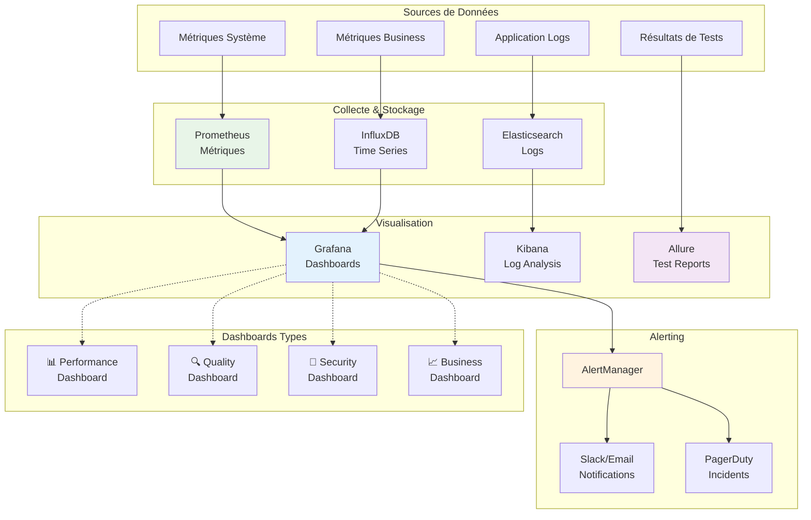

# Architecture Monitoring et Dashboards

## Composants du Monitoring

### Collecte de Données
- **Prometheus** : Métriques système et application
- **Elasticsearch** : Centralisation et indexation des logs
- **InfluxDB** : Données temporelles haute performance

### Visualisation
- **Grafana** : Dashboards interactifs et alerting
- **Kibana** : Analyse et recherche dans les logs
- **Allure** : Rapports de tests détaillés

### Types de Dashboards
1. **Performance** : Temps de réponse, throughput, erreurs
2. **Quality** : Couverture de code, taux de réussite des tests
3. **Security** : Vulnérabilités, tentatives d'intrusion
4. **Business** : KPIs métier, conversion, utilisation